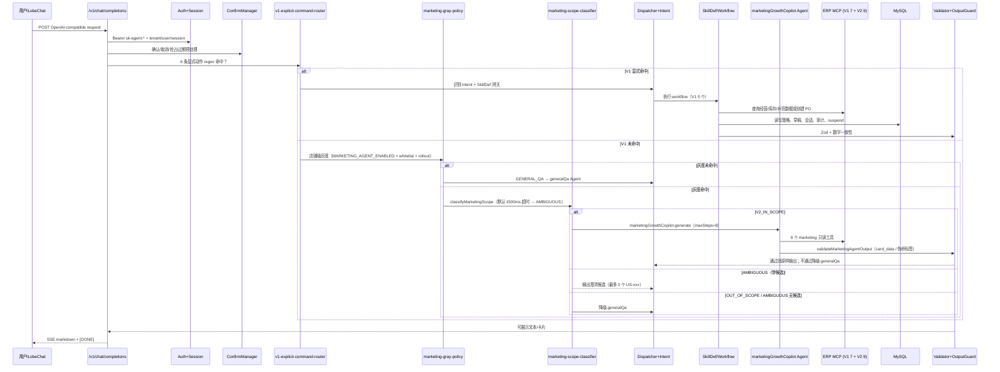

# AI_ONTOLOGY.md — StorePilotAI 本体上下文入口

> 目标：作为“业务 ↔ 代码”的翻译层，帮助 Codex / 大模型在规划、评审、编码前先理解项目的领域边界、运行链路、安全红线和变更方向。  
> 默认只读本文件；需要更深上下文时，再按“渐进式加载路由”读取专题文档，避免 token 爆炸。  
> **V1 = 经营日报/月报 + 补货预测/调整 + 采购单 HITL；V2 阶段二 = 单店营销增长副驾驶 marketingGrowthCopilot + 9 个只读 marketing MCP 工具 + V1 显式指令 → 店铺级灰度 → 范围分类器三段路由。**

## 0. 本文件怎么用

- **规划/编码前**：先读本文件，再按任务读取专题文档。
- **不确定业务含义时**：优先查 `docs/ai-ontology/02_domain_model.md`。
- **涉及安全、采购单、补货、租户、MCP、数字输出时**：必须查 `docs/ai-ontology/07_guardrails.md` 和 `cards/`。
- **要落库或改表时**：必须查 `docs/ai-ontology/06_data_persistence.md` 和 `09_open_issues.md`。
- **要判断代码与文档差异时**：查 `docs/ai-ontology/10_evidence_index.md`，再回到具体源码/迁移文件。

## 1. 项目一句话

`storepilot-ai` 是“门店助手 Agent”工程：

- **V1（已上线）**：面向多商家、多门店的经营分析、补货建议、补货草稿调整与采购单确认闭环（5 个 workflow + 7 个 MCP 工具）。
- **V2 阶段二（gray，默认关闭）**：单店营销增长副驾驶 `marketingGrowthCopilot`，通过 9 个只读 marketing MCP 工具围绕"会员/商品/POS/券/活动/库存"给出建议；只许只读、不发券、不改库存、不调用 `createPurchaseOrder`。

代码形态是 TypeScript pnpm monorepo，核心包包括 `@storepilot/agent-service`、`@storepilot/shared-contracts` 和 `@storepilot/mcp-mock-server`。

## 2. 项目本体的核心结论

| 层 | 核心对象 | 当前代码落地 |
| --- | --- | --- |
| 组织域 | Merchant, Store, User, StoreRole | 通过 Auth、RuntimeContext、Session、MCP scope、Strategy 隔离；`agent_api_key.store_role`（V2 加入，默认 `BOSS`）参与营销可见性。本地不维护完整业务主数据表。 |
| 商品域 | Category, Sku, Supplier, SkuPerformance, InventorySnapshot(v2) | V1 经 MCP 契约访问；V2 在本地新增 `marketing_sku_profile`、`marketing_inventory_snapshot` 维护毛利率、库龄、`SLOW_MOVING/NEAR_EXPIRY/PHASE_OUT` 等营销维度。 |
| 经营域 | SalesSummary, InventoryOverview, SalesRank, PosTimeBucket | V1 报表只读 MCP；V2 新增 POS 时段桶（HOUR/DAY，`marketing_pos_order/_item`）。 |
| 补货域 | ReplenishmentDraft, DraftItem, AdjustmentInstruction, PurchaseOrder | 草稿和调整日志本地持久化；采购单通过高风险 MCP 写工具创建。 |
| 营销/会员域（V2） | Member, MemberSegment(12 segmentCode), Coupon, Campaign, MemberConsumptionOrder, MemberBalance | `marketing_member_profile/balance`、`marketing_coupon`、`marketing_campaign_record` 本地落表；姓名/手机一律使用 `nameMasked`/`phoneMasked`。 |
| 策略域 | Platform/Merchant/Store Strategy, EffectiveStrategy, MarketingGrayPolicy | Store > Merchant > Platform 合并；V2 营销额外受 `MARKETING_AGENT_ENABLED` + store whitelist + sha256 rollout 灰度控制。 |
| Agent 域 | Intent, SkillDef/Skill, Workflow, MastraAgent, Tool, AgentSession, AgentToolCallTrace | Intent 驱动 dispatcher；`agent_skill_def.skill_code` 绑定运行时守门 ID、allowed intents、required tools、risk/status。V1 5 行是 Workflow 形态，V2 新增 `marketing_growth_copilot` 是 Agent 形态，真实执行入口是 `AgentBundle.marketingGrowthCopilot.generate`，另有轻量 workflow wrapper。`agent_tool_call_trace` 是 V2 工具调用审计表（已建表）。 |
| 展示域 | MarkdownReport, Cards, Insights, MarketingProductCard | 输出给 ChatCompletions SSE；V1/V2 都必须经过输出守卫和数字一致性校验；V2 marketing 输出需含合法 `<!-- card_data:start -->` 注释块。 |
| 基础设施 | Hono API, Mastra 1.32, MCP Client, MySQL, Health, Env, ExternalSkillsWorkspace | agent-service 启动期校验 DB、MCP 16 工具白名单、SkillDef、workflow 一致性；External Skills 在生产强制只读 + 禁脚本 + sha256/HTTPS allowlist + 灰度交集 fail-closed。 |

## 3. 永远优先保留的业务方向

1. **AI 是经营助手，不是自主经营主体**：它可以分析、建议、草拟，但不能无确认下单；V2 营销副驾驶进一步收紧——**只读、不发券、不改库存、不改价、不改积分**。
2. **ERP/MCP 是经营事实来源**：销售、库存、SKU、供应商、采购单写入均以 MCP/ERP 或本地草稿为事实源；V2 marketing 9 个工具均为只读，返回数字一律不可由 LLM 改写。
3. **本地数据库主要存 Agent 运行态 + V2 营销事实缓存**：V1 表都是 Agent 运行态（策略、SkillDef、会话、草稿、审计、workflow）；V2 marketing 7 张表是"营销事实快照"（会员、券、活动、POS、库存维度），仍以 ERP/MCP 为权威，本地是结构化派生层。
4. **安全边界优先于体验捷径**：采购单、租户隔离、工具白名单、数字校验、输出守卫不可为"更顺滑"而绕过；V2 marketing 还要保留店铺级灰度、PII 脱敏、工具调用上限 8 步。
5. **shared-contracts 是跨包契约 SSOT**：Intent、Draft、Strategy、SkillDef/Skill、MCP（含 V2 marketing 9 工具）、HTTP/Error schema 变更要先看共享契约。

## 4. 不可变规则红线

| 规则 | 含义 | 先读 |
| --- | --- | --- |
| R-AI-001 | 不编造经营数据、库存、SKU、采购数量、会员/券/活动数字。 | `07_guardrails.md` |
| R-AI-002 | 创建采购单必须用户明确确认。 | `cards/purchase_order_high_risk.md` |
| R-AI-003 | 不从 Markdown 反解析提单明细。 | `cards/purchase_order_high_risk.md` |
| R-SEC-001 | merchantId/storeId/userId 强隔离。 | `cards/tenant_isolation.md` |
| R-SKILL-001 | SkillDef 与 workflow id / Agent 执行入口必须一致；V1 workflow 启动期严格校验，V2 Agent 形态需额外关注 wrapper 与真实执行链路差异。 | `cards/skill_gate.md`, `09_open_issues.md` |
| R-MCP-001 | MCP 工具集合（V1 7 + V2 9 = 16）与 schema 必须严格匹配。 | `cards/mcp_contract_drift.md` |
| R-NUM-001 | 输出数字必须来自允许集或确定性派生。 | `cards/report_number_consistency.md` |
| R-OUT-001 | 不泄漏工具调用结构给前端。 | `07_guardrails.md` |
| R-V2-AGENT-001 | `marketingGrowthCopilot` 最多 8 步、只能用 9 个 marketing 只读工具；禁调 `createPurchaseOrder`，不发券/不改库存/不改价/不改积分。 | `cards/marketing_scope_router.md` |
| R-V2-PII-001 | 老板可见输出只能用 `nameMasked`/`phoneMasked`；禁止输出完整姓名、完整手机号、身份证、邮箱、地址，禁止 `traceId`/`merchantId`/`storeId`/`agent_run_id`。 | `cards/marketing_agent_pii_and_output_guard.md` |
| R-V2-SCOPE-001 | V2 流量必须经 `v1-explicit-command-router` → `marketing-gray-policy` → `marketing-scope-classifier`（默认 1500ms，生产建议 ≤2000ms）三段路由；任何路径不得直达 marketingGrowthCopilot。 | `cards/marketing_scope_router.md`, `09_open_issues.md` |
| R-V2-OUTPUT-001 | marketing Agent 输出目标语义：必须含 `<!-- card_data:start -->` 或存在真实 tool call；含伪桥标签 `<ASK>`/`<FALLBACK>` 立即降级 generalQa。当前 toolCallCount 固定值风险见 open issues。 | `cards/marketing_agent_pii_and_output_guard.md`, `09_open_issues.md` |
| R-V2-EXT-SKILL-001 | `marketingGrowthCopilot` 禁止加载 External Skills；External Skills 在生产强制只读 + 禁脚本 + sha256/HTTPS allowlist + 灰度交集 fail-closed。 | `07_guardrails.md` |

## 5. 渐进式加载路由

| 任务类型 | 先读 | 再读 | 何时读证据 |
| --- | --- | --- | --- |
| 新增/修改 SkillDef、Skill、Intent、Workflow | `04_skill_intent_workflow.md` | `07_guardrails.md`, `cards/skill_gate.md` | 改 dispatcher、seed、workflow、Mastra Agent 前 |
| 修改补货预测/调整/采购单 | `02_domain_model.md`, `07_guardrails.md` | `cards/replenishment_draft_state_machine.md`, `cards/purchase_order_high_risk.md` | 涉及 draft/PO 状态时 |
| 修改 MCP 工具或 shared-contracts | `05_mcp_contracts.md` | `cards/mcp_contract_drift.md` | 改工具名/schema/mock/client/marketing 9 工具前 |
| 修改数据库/迁移 | `06_data_persistence.md` | `09_open_issues.md` | 新增 migration、字段或索引前 |
| 修改 ChatCompletions/SSE/网关 | `03_runtime_and_boundaries.md` | `07_guardrails.md` | 改请求/输出/鉴权前 |
| 修改日报/月报输出 | `04_skill_intent_workflow.md` | `cards/report_number_consistency.md` | 改数字、卡片、insight 前 |
| **修改 V2 营销范围 / 灰度 / 范围分类器** | `cards/marketing_scope_router.md`, `07_guardrails.md` | `03_runtime_and_boundaries.md`, `04_skill_intent_workflow.md` | 改 V1 显式动作 regex / `MARKETING_AGENT_*` env / scope examples / scope prompt 前 |
| **修改 marketingGrowthCopilot 指令 / Phase2 规则 / US-xxx** | `04_skill_intent_workflow.md`, `cards/marketing_agent_pii_and_output_guard.md` | `02_domain_model.md`, `cards/marketing_scope_router.md` | 改 `marketing-growth-copilot.ts` / `marketing/phase2/**` / `us-display-names.ts` 前 |
| **修改 marketing 输出守卫 / PII 脱敏** | `cards/marketing_agent_pii_and_output_guard.md`, `07_guardrails.md` | `03_runtime_and_boundaries.md` | 改 `output-guard.ts` / `MARKETING_GROWTH_INSTRUCTIONS` 前 |
| **修改 External Skills 加载/沙箱** | `07_guardrails.md`（R-V2-EXT-SKILL-001） | `03_runtime_and_boundaries.md`, `09_open_issues.md` | 改 `mastra/skills/**` / `EXTERNAL_SKILLS_*` env 前 |
| 修复项目状态/README/文档 | `09_open_issues.md` | `10_evidence_index.md` | 更新 SSOT 前 |

## 6. 运行时总链路

V1 显式指令优先；未命中再走 V2 营销三段路由（默认 disabled，灰度逐店放量）：



## 7. 编码/规划时的标准输出格式

大模型在提出方案前，先给出这个简短判断，之后再展开：

```text
Ontology impact:
- task_type: <skill|mcp|db|runtime|report|docs|bugfix>
- touched_entities: [Skill, Intent, Workflow, ...]
- touched_relations: [requiresTool, implementsWorkflow, writes, ...]
- guardrails_checked: [R-AI-001, R-SEC-001, ...]
- source_of_truth: [shared-contracts, migrations, workflow, docs, ...]
- risk_level: LOW|MEDIUM|HIGH
- expected_tests: [...]
```

## 8. 当前项目已知差异，避免误判

- README 切片状态可能落后于当前代码实现。
- 原本体模型文档中的数据表建议与实际 migrations 有字段差异；**以 migrations 为当前持久化 SSOT**。
- `migrations` 中存在两个 `011-*` 文件，后续新增迁移已使用 `012+` 唯一编号（V2 marketing 012-018）。
- `replenishment_adjustment` workflow 已实现，dispatcher 已对 `ADJUST_REPLENISHMENT_DRAFT` 接入 `loadActiveDraft → extractInstruction → applyInstruction → persistAdjustment` 四步；若排查历史问题，需以当前 dispatcher 源码为准。
- Merchant/Store/Sku/Category/Supplier 等核心业务主数据主要由 ERP/MCP 承担，本地表以 Agent 运行态为主；V2 marketing 7 张表是"营销事实快照"，仍以 ERP/MCP 为权威。
- **V2 营销默认关闭**：`MARKETING_AGENT_ENABLED=false`、`MARKETING_AGENT_ROLLOUT_PERCENT=0`，需要 env 开 + 店铺命中 whitelist 或 sha256 rollout 桶才进入。
- **V2 scope classifier 强依赖 LLM**：超时 / 非法 JSON 一律降级 `AMBIGUOUS+degraded=true`，不会因为外部模型故障打挂对话。
- **`agent_tool_call_trace` 表已建（migration 017）但运行时尚未写入**，记入 `09_open_issues.md` `D-AGENT-TOOL-CALL-TRACE-NOT-WIRED`。
- **V2 red-team 待治理项**：`D-V2-MARKETING-OUTPUT-GUARD-TOOLCOUNT`、`D-V2-SCOPE-TIMEOUT-UPPER-BOUND`、`D-V2-SCOPE-CONFIDENCE-NORMALIZATION`、`D-V2-SKILLDEF-AGENT-WORKFLOW-WRAPPER-AMBIGUITY` 均在 `09_open_issues.md`；不要把目标红线误写成已完全落地的运行时保证。
- **US 编码 001-018 已定义、003-010 已实现**（含规则、输出、L2/L3/L4 redline），001/002/011-018 尚未实现；scope classifier 候选枚举与已实现集合存在差距。
- **External Skills 受控加载**（commit a79f140）：生产强制只读 + 禁脚本 + sha256/HTTPS allowlist + 灰度交集 fail-closed；marketingGrowthCopilot 不读外部 Skills。

## 9. 文档资产

- `docs/ai-ontology/00_context_manifest.md`：按任务加载索引。
- `docs/ai-ontology/01_core_ontology.md`：项目核心本体。
- `docs/ai-ontology/02_domain_model.md`：业务对象词典（V1 经营 + V2 营销/会员域）。
- `docs/ai-ontology/03_runtime_and_boundaries.md`：服务边界和请求链路（含 V2 三段路由）。
- `docs/ai-ontology/04_skill_intent_workflow.md`：Intent、Skill、Workflow、Mastra Agent。
- `docs/ai-ontology/05_mcp_contracts.md`：MCP 16 工具（V1 7 + V2 9）和契约漂移规则。
- `docs/ai-ontology/06_data_persistence.md`：本地数据表和状态（含 V2 marketing 7 表 + tool call trace）。
- `docs/ai-ontology/07_guardrails.md`：业务/安全规则（含 5 条 R-V2-*）。
- `docs/ai-ontology/08_codex_change_playbook.md`：按变更类型的编码手册。
- `docs/ai-ontology/cards/`：高频高风险小卡片，优先给模型局部加载（V1 5 张 + V2 2 张）。
