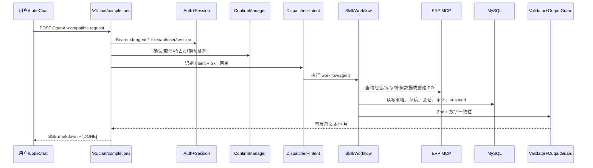

# AI_ONTOLOGY.md — StorePilotAI 本体上下文入口

> 目标：作为“业务 ↔ 代码”的翻译层，帮助 Codex / 大模型在规划、评审、编码前先理解项目的领域边界、运行链路、安全红线和变更方向。  
> 默认只读本文件；需要更深上下文时，再按“渐进式加载路由”读取专题文档，避免 token 爆炸。

## 0. 本文件怎么用

- **规划/编码前**：先读本文件，再按任务读取专题文档。
- **不确定业务含义时**：优先查 `docs/ai-ontology/02_domain_model.md`。
- **涉及安全、采购单、补货、租户、MCP、数字输出时**：必须查 `docs/ai-ontology/07_guardrails.md` 和 `cards/`。
- **要落库或改表时**：必须查 `docs/ai-ontology/06_data_persistence.md` 和 `09_open_issues.md`。
- **要判断代码与文档差异时**：查 `docs/ai-ontology/10_evidence_index.md`，再回到具体源码/迁移文件。

## 1. 项目一句话

`storepilot-ai` 是“门店助手 Agent V1”工程：面向多商家、多门店的经营分析、补货建议、补货草稿调整与采购单确认闭环。代码形态是 TypeScript pnpm monorepo，核心包包括 `@storepilot/agent-service`、`@storepilot/shared-contracts` 和 `@storepilot/mcp-mock-server`。

## 2. 项目本体的核心结论

| 层 | 核心对象 | 当前代码落地 |
| --- | --- | --- |
| 组织域 | Merchant, Store, User | 通过 Auth、RuntimeContext、Session、MCP scope、Strategy 隔离；本地不维护完整业务主数据表。 |
| 商品域 | Category, Sku, Supplier | 主要来自 MCP 契约和 ERP 数据；补货草稿/采购单引用 SKU 与供应商。 |
| 经营域 | SalesSummary, InventorySnapshot, SalesRank | 通过只读 MCP 工具查询；日报/月报消费这些数据。 |
| 补货域 | ReplenishmentDraft, DraftItem, AdjustmentInstruction, PurchaseOrder | 草稿和调整日志本地持久化；采购单通过高风险 MCP 写工具创建。 |
| 策略域 | Platform/Merchant/Store Strategy, EffectiveStrategy | Store > Merchant > Platform 合并；关键安全开关写死为安全值。 |
| Agent 域 | Intent, Skill, Workflow, Tool, AgentSession | Intent 驱动 dispatcher；Skill 绑定 workflow、allowed intents、required tools、risk/status。 |
| 展示域 | MarkdownReport, Cards, Insights | 输出给 ChatCompletions SSE；必须经过输出守卫和数字一致性校验。 |
| 基础设施 | Hono API, Mastra, MCP Client, MySQL, Health, Env | agent-service 启动期校验 DB、MCP 工具、SkillDef、workflow 一致性。 |

## 3. 永远优先保留的业务方向

1. **AI 是经营助手，不是自主经营主体**：它可以分析、建议、草拟，但不能无确认下单。
2. **ERP/MCP 是经营事实来源**：销售、库存、SKU、供应商、采购单写入均以 MCP/ERP 或本地草稿为事实源。
3. **本地数据库主要存 Agent 运行态**：策略、Skill、会话、草稿、审计、workflow 状态；核心业务主数据仍在 ERP/MCP 侧。
4. **安全边界优先于体验捷径**：采购单、租户隔离、工具白名单、数字校验、输出守卫不可为“更顺滑”而绕过。
5. **shared-contracts 是跨包契约 SSOT**：Intent、Draft、Strategy、Skill、MCP、HTTP/Error schema 变更要先看共享契约。

## 4. 不可变规则红线

| 规则 | 含义 | 先读 |
| --- | --- | --- |
| R-AI-001 | 不编造经营数据、库存、SKU、采购数量。 | `07_guardrails.md` |
| R-AI-002 | 创建采购单必须用户明确确认。 | `cards/purchase_order_high_risk.md` |
| R-AI-003 | 不从 Markdown 反解析提单明细。 | `cards/purchase_order_high_risk.md` |
| R-SEC-001 | merchantId/storeId/userId 强隔离。 | `cards/tenant_isolation.md` |
| R-SKILL-001 | SkillDef 与 workflow id 启动期严格一致。 | `cards/skill_gate.md` |
| R-MCP-001 | MCP 工具集合与 schema 必须严格匹配。 | `cards/mcp_contract_drift.md` |
| R-NUM-001 | 输出数字必须来自允许集或确定性派生。 | `cards/report_number_consistency.md` |
| R-OUT-001 | 不泄漏工具调用结构给前端。 | `07_guardrails.md` |

## 5. 渐进式加载路由

| 任务类型 | 先读 | 再读 | 何时读证据 |
| --- | --- | --- | --- |
| 新增/修改 Skill、Intent、Workflow | `04_skill_intent_workflow.md` | `07_guardrails.md`, `cards/skill_gate.md` | 改 dispatcher、seed、workflow 前 |
| 修改补货预测/调整/采购单 | `02_domain_model.md`, `07_guardrails.md` | `cards/replenishment_draft_state_machine.md`, `cards/purchase_order_high_risk.md` | 涉及 draft/PO 状态时 |
| 修改 MCP 工具或 shared-contracts | `05_mcp_contracts.md` | `cards/mcp_contract_drift.md` | 改工具名/schema/mock/client 前 |
| 修改数据库/迁移 | `06_data_persistence.md` | `09_open_issues.md` | 新增 migration、字段或索引前 |
| 修改 ChatCompletions/SSE/网关 | `03_runtime_and_boundaries.md` | `07_guardrails.md` | 改请求/输出/鉴权前 |
| 修改日报/月报输出 | `04_skill_intent_workflow.md` | `cards/report_number_consistency.md` | 改数字、卡片、insight 前 |
| 修复项目状态/README/文档 | `09_open_issues.md` | `10_evidence_index.md` | 更新 SSOT 前 |

## 6. 运行时总链路



## 7. 编码/规划时的标准输出格式

大模型在提出方案前，先给出这个简短判断，之后再展开：

```text
Ontology impact:
- task_type: <skill|mcp|db|runtime|report|docs|bugfix>
- touched_entities: [Skill, Intent, Workflow, ...]
- touched_relations: [requiresTool, implementsWorkflow, writes, ...]
- guardrails_checked: [R-AI-001, R-SEC-001, ...]
- source_of_truth: [shared-contracts, migrations, workflow, docs, ...]
- risk_level: LOW|MEDIUM|HIGH
- expected_tests: [...]
```

## 8. 当前项目已知差异，避免误判

- README 切片状态可能落后于当前代码实现。
- 原本体模型文档中的数据表建议与实际 migrations 有字段差异；**以 migrations 为当前持久化 SSOT**。
- `migrations` 中存在两个 `011-*` 文件，后续新增迁移需注意唯一编号。
- `replenishment_adjustment` workflow 已实现，但 dispatcher 对调整意图仍返回“尚未完整接入桥接层”。
- Merchant/Store/Sku/Category/Supplier 等核心业务主数据主要由 ERP/MCP 承担，本地表以 Agent 运行态为主。

## 9. 文档资产

- `docs/ai-ontology/00_context_manifest.md`：按任务加载索引。
- `docs/ai-ontology/01_core_ontology.md`：项目核心本体。
- `docs/ai-ontology/02_domain_model.md`：业务对象词典。
- `docs/ai-ontology/03_runtime_and_boundaries.md`：服务边界和请求链路。
- `docs/ai-ontology/04_skill_intent_workflow.md`：Intent、Skill、Workflow。
- `docs/ai-ontology/05_mcp_contracts.md`：MCP 工具和契约漂移规则。
- `docs/ai-ontology/06_data_persistence.md`：本地数据表和状态。
- `docs/ai-ontology/07_guardrails.md`：业务/安全规则。
- `docs/ai-ontology/08_codex_change_playbook.md`：按变更类型的编码手册。
- `docs/ai-ontology/cards/`：高频高风险小卡片，优先给模型局部加载。
