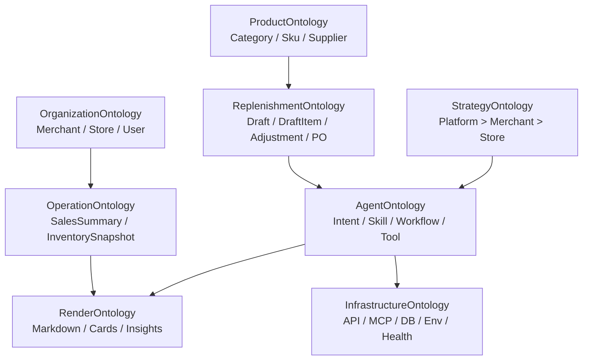

# 01. Core Ontology — 项目核心本体

## 1. 项目定位

`storepilot-ai` 是门店助手 Agent V1。它的业务目标是把多商家、多门店经营数据统一到 Agent 能理解的语义层中，用 Skill 和策略完成经营分析、补货建议、补货草稿调整与采购单确认闭环。

工程定位：TypeScript pnpm monorepo，根项目脚本覆盖 build、lint、typecheck、test、migrate、dev:agent、dev:mcp。核心代码分布：

| 包/目录 | 本体类型 | 职责 |
| --- | --- | --- |
| `packages/agent-service` | SystemComponent | 主 Agent 服务；Hono API、Mastra workflow、MCP client、MySQL、安全层、SSE。 |
| `packages/shared-contracts` | ContractSSOT | Intent、Draft、Strategy、Skill、MCP、HTTP、Error 的共享 Zod 契约。 |
| `packages/mcp-mock-server` | MockExternalSystem | ERP MCP mock；dev/CI 使用，生产禁用。 |
| `migrations` | PersistenceSSOT | 当前本地持久化结构的事实来源。 |
| `docs` | DesignKnowledge | 产品、切片、原始本体、运维和设计说明。 |

## 2. 顶层本体层

## 3. 核心关系

| 关系 | 解释 | 代码/文档落点 |
| --- | --- | --- |
| `Merchant owns Store` | 商家拥有门店，租户隔离边界。 | Auth、RuntimeContext、Session、MCP scope。 |
| `Store has SalesSummary/InventorySnapshot` | 经营数据以门店为主要查询范围。 | MCP 查询工具。 |
| `Category contains Sku` | 商品分类关系。 | MCP 补货基础数据、品类占比。 |
| `AgentSession creates ReplenishmentDraft` | 会话驱动补货草稿。 | `agent_session`, `replenishment_draft`。 |
| `ReplenishmentDraft contains DraftItem` | 草稿保存结构化 SKU 明细。 | `items` JSON。 |
| `Draft adjustedBy AdjustmentInstruction` | 用户自然语言调整转结构化指令。 | `replenishment_adjustment_log`。 |
| `Draft submittedAs PurchaseOrder` | 确认后创建 ERP 采购单。 | `createPurchaseOrder` MCP。 |
| `Skill requires MCP Tool` | Skill 只能使用白名单工具。 | `agent_skill_def.required_tools`。 |
| `Skill implements Workflow` | Skill code 与 workflow id 一致。 | workflow barrel + seed。 |
| `agent-service exposes ChatCompletions` | 前端统一对话入口。 | `/v1/chat/completions`。 |

## 4. 本地系统不是 ERP 替代品

本仓库并没有把 Merchant、Store、Sku、Category、Supplier、SalesSummary、InventorySnapshot 建成本地主数据表。它们主要通过：

- API Key / RuntimeContext / Session 中的租户上下文；
- MCP 工具输入输出契约；
- strategy/draft/agent run 等本地运行态字段；
- 原始本体文档中的业务定义；

来参与业务决策。

因此，修改代码时不要默认“缺什么业务表就新增什么业务主表”。如果需要本地落表，要先确认这是 Agent 运行态，还是 ERP 主数据职责迁移。

## 5. 本体事实来源优先级

| 场景 | 优先事实来源 |
| --- | --- |
| Intent/Draft/Strategy/Skill/MCP schema | `packages/shared-contracts/src` |
| 实际数据库结构 | `migrations/*.sql` |
| 实际运行链路 | `packages/agent-service/src` |
| Mock 行为 | `packages/mcp-mock-server/src` |
| 业务设计意图 | `docs/门店助手Agent_V1_本体模型文档.md` |
| 项目状态 | 当前代码 + migrations；README 可能滞后 |

## 6. 模型推理边界

大模型可以做：业务解释、设计建议、影响分析、规则对照、文档更新、代码结构定位。  
大模型不能做：根据展示文本猜采购明细、凭空造销售/库存数字、绕过确认下单、跨租户查询状态、隐式扩大 MCP 工具权限。
