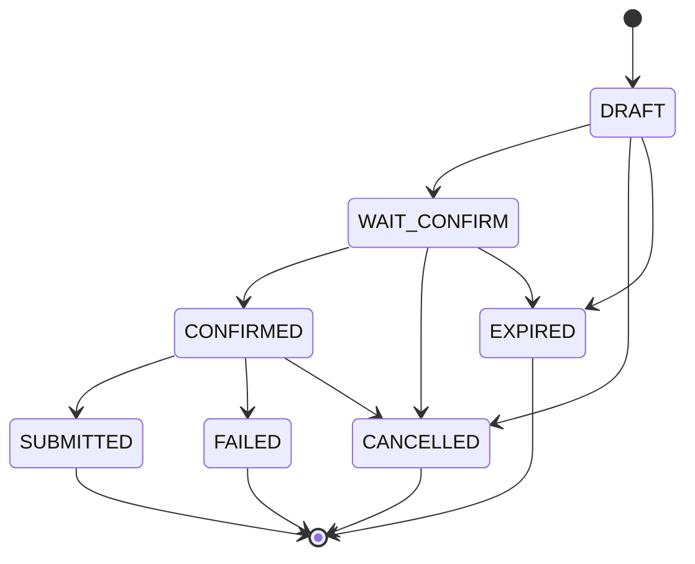

# 02. Domain Model — 领域对象词典

## 1. 组织域

| 对象 | 定义 | 当前落地 | 修改提醒 |
| --- | --- | --- | --- |
| Merchant | 使用系统的商家，是策略、Skill、数据隔离一级边界。 | API key、RuntimeContext、Strategy、MCP tenant scope。 | 所有运行态 SQL 和 MCP 调用要带 merchantId。 |
| Store | 商家下的经营单元，日报、库存、补货的主要范围。 | API key、session、draft、strategy、MCP scope。 | 涉及店铺上下文时要带 storeId，不得只按 session 查。 |
| User | 发起对话、调整草稿、确认采购单的人。 | API key 派生、agent_session、draft.user_id。 | HITL 确认不能只依赖自然语言，要绑定会话和用户上下文。 |

## 2. 商品与经营域

| 对象 | 定义 | 当前落地 | 注意 |
| --- | --- | --- | --- |
| Category | SKU 分类，用于品类占比和补货分组。 | MCP `queryCategorySalesRatio`, `queryReplenishmentBaseData`。 | 本地无主表，不能假设 category code 全量存在。 |
| Sku | 库存、销售、补货建议最小商品单元。 | MCP item、DraftItem、PO item。 | PO 明细必须来自草稿结构化 items。 |
| Supplier | 供货来源。 | MCP 补货基础数据和 createPurchaseOrder 入参。 | 供应商可用性以 MCP/ERP 为准。 |
| SalesSummary | 销售额、订单数、客单价等汇总指标。 | `queryStoreSalesSummary`。 | 报表数字只能来自工具返回或确定性派生。 |
| InventorySnapshot | 库存 SKU、低库存、缺货、库存价值。 | `queryInventoryOverview`。 | 补货和报表要区分库存快照时间。 |

## 3. 补货域

| 对象 | 定义 | 当前落地 | 高风险点 |
| --- | --- | --- | --- |
| ReplenishmentDraft | 补货预测产生的可调整草稿。 | `replenishment_draft` 表 + DraftManager。 | 状态机不可绕过；过期/租户隔离要保留。 |
| DraftItem | 每个 SKU 的建议数量、最终数量、原因。 | `replenishment_draft.items` JSON。 | 创建 PO 必须使用此结构化数据。 |
| AdjustmentInstruction | 自然语言调整转换出的结构化 target/op/rate/qty。 | shared-contracts + adjustment workflow/log。 | 目标匹配、最大调整次数、审计日志要保留。 |
| PurchaseOrder | 确认后创建的 ERP 采购单。 | `createPurchaseOrder` MCP 写工具。 | HIGH 风险；必须 HITL、幂等、来源校验。 |

### 补货关系图

## 4. 策略域

| 对象 | 含义 | 当前落地 |
| --- | --- | --- |
| PlatformStrategy | 平台默认策略，兜底层。 | `agent_merchant_strategy` 中 `merchant_id='__PLATFORM_DEFAULT__'`。 |
| MerchantStrategy | 商家级覆盖策略。 | `agent_merchant_strategy`。 |
| StoreStrategy | 门店级覆盖策略，优先级最高。 | `agent_store_strategy`。 |
| EffectiveStrategy | Store > Merchant > Platform 合并结果。 | StrategyEngine。 |

关键安全语义：`allowAutoPurchaseOrder=false`，`requireUserConfirmForWrite=true`。任何业务设计都不能让 AI 自动创建采购单。

## 5. Agent 域

| 对象 | 定义 | 当前落地 |
| --- | --- | --- |
| Intent | 用户请求语义分类。 | 11 个枚举，驱动 dispatcher。 |
| Skill | 可执行业务能力。 | `agent_skill_def` + workflow id。 |
| Workflow | Mastra 工作流，执行具体业务链路。 | 5 个 workflow。 |
| Tool | MCP 工具，ERP 数据读写能力。 | 7 个工具，6 读 1 写。 |
| AgentSession | 会话、活动草稿、HITL active run 状态。 | `agent_session`。 |

## 6. 展示域

报表、补货结果、采购单预览最终会以 SSE markdown、cards、insights、source summary 输出。展示层不是事实源；不得从展示文本反推结构化业务动作。
