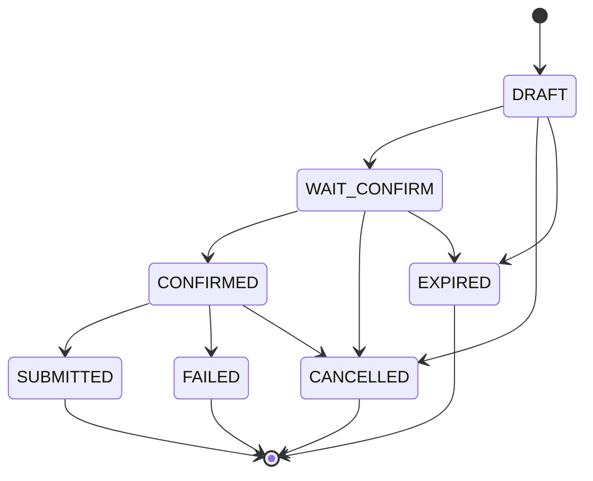

# 02. Domain Model — 领域对象词典

## 1. 组织域

| 对象 | 定义 | 当前落地 | 修改提醒 |
| --- | --- | --- | --- |
| Merchant | 使用系统的商家，是策略、Skill、数据隔离一级边界。 | API key、RuntimeContext、Strategy、MCP tenant scope。 | 所有运行态 SQL 和 MCP 调用要带 merchantId。 |
| Store | 商家下的经营单元，日报、库存、补货、营销建议的主要范围。 | API key、session、draft、strategy、MCP scope、marketing 表。 | 涉及店铺上下文时要带 storeId，不得只按 session 查。 |
| User | 发起对话、调整草稿、确认采购单的人。 | API key 派生、agent_session、draft.user_id。 | HITL 确认不能只依赖自然语言，要绑定会话和用户上下文。 |
| StoreRole（V2） | API key 关联的店铺角色（默认 `BOSS`）。 | `agent_api_key.store_role`（migration 018 ALTER）。 | V2 营销输出按"老板可见"约束做 PII 脱敏；后续如新增角色要回填本表。 |

## 2. 商品与经营域

| 对象 | 定义 | 当前落地 | 注意 |
| --- | --- | --- | --- |
| Category | SKU 分类，用于品类占比和补货分组。 | MCP `queryCategorySalesRatio`, `queryReplenishmentBaseData`。 | 本地无主表，不能假设 category code 全量存在。 |
| Sku | 库存、销售、补货建议最小商品单元。 | MCP item、DraftItem、PO item。 | PO 明细必须来自草稿结构化 items。 |
| Supplier | 供货来源。 | MCP 补货基础数据和 createPurchaseOrder 入参。 | 供应商可用性以 MCP/ERP 为准。 |
| SalesSummary | 销售额、订单数、客单价等汇总指标。 | `queryStoreSalesSummary`。 | 报表数字只能来自工具返回或确定性派生。 |
| InventoryOverview | 库存 SKU、低库存、缺货、库存价值。 | `queryInventoryOverview`。 | 补货和报表要区分库存快照时间。 |
| SkuPerformance（V2） | SKU 销量、销售额、毛利率、趋势（UP/FLAT/DOWN）、库存状态。 | MCP `query_product_performance`；本地 `marketing_sku_profile` 缓存维度。 | 营销建议必须过滤缺货 SKU，并提示毛利/合规/品牌风险。 |
| InventorySnapshot v2（V2） | 营销维度的库存：`stockAgeDays`、`slowMovingFlag`、`status`(IN_STOCK/LOW_STOCK/OUT_OF_STOCK/SLOW_MOVING/NEAR_EXPIRY/PHASE_OUT)。 | MCP `query_inventory_status`；本地 `marketing_inventory_snapshot`。 | 滞销/临期判定按本对象，不要从 V1 `InventoryOverview` 反推。 |
| PosTimeBucket（V2） | POS 时段桶（HOUR/DAY），含会员/散客订单数。 | MCP `query_pos_summary_by_time`；本地 `marketing_pos_order/_item`。 | 时段桶上限 366 行；不要让 LLM 自己聚合 POS 原始单据。 |

## 3. 补货域

| 对象 | 定义 | 当前落地 | 高风险点 |
| --- | --- | --- | --- |
| ReplenishmentDraft | 补货预测产生的可调整草稿。 | `replenishment_draft` 表 + DraftManager。 | 状态机不可绕过；过期/租户隔离要保留。 |
| DraftItem | 每个 SKU 的建议数量、最终数量、原因。 | `replenishment_draft.items` JSON。 | 创建 PO 必须使用此结构化数据。 |
| AdjustmentInstruction | 自然语言调整转换出的结构化 target/op/rate/qty。 | shared-contracts + adjustment workflow/log。 | 目标匹配、最大调整次数、审计日志要保留。 |
| PurchaseOrder | 确认后创建的 ERP 采购单。 | `createPurchaseOrder` MCP 写工具。 | HIGH 风险；必须 HITL、幂等、来源校验。 |

### 补货关系图

## 4. 策略域

| 对象 | 含义 | 当前落地 |
| --- | --- | --- |
| PlatformStrategy | 平台默认策略，兜底层。 | `agent_merchant_strategy` 中 `merchant_id='__PLATFORM_DEFAULT__'`。 |
| MerchantStrategy | 商家级覆盖策略。 | `agent_merchant_strategy`。 |
| StoreStrategy | 门店级覆盖策略，优先级最高。 | `agent_store_strategy`。 |
| EffectiveStrategy | Store > Merchant > Platform 合并结果。 | StrategyEngine。 |

关键安全语义：`allowAutoPurchaseOrder=false`，`requireUserConfirmForWrite=true`。任何业务设计都不能让 AI 自动创建采购单。

## 5. 营销/会员域（V2 阶段二）

V2 单店营销增长副驾驶 `marketingGrowthCopilot` 围绕"会员 / 商品 / POS / 券 / 活动 / 库存"6 个事实面给老板建议；所有数字必须来自 9 个 marketing 只读 MCP 工具或确定性计算。

| 对象 | 定义 | 当前落地 | 注意 |
| --- | --- | --- | --- |
| Member | 单店会员，含 level/status/joinDate/lastVisitAt/totalSpent/avgRepurchaseDays。 | MCP `query_member_profile`；本地 `marketing_member_profile`。 | 姓名/手机统一使用 `nameMasked`/`phoneMasked`（R-V2-PII-001）。 |
| MemberLevel | 会员等级。 | `NEW / NORMAL / SILVER / GOLD / VIP`。 | 与策略侧不冲突；不要扩成自由文本。 |
| MemberStatus | 会员状态。 | `ACTIVE / DORMANT / CHURNED`。 | "沉睡"判定走 segmentCode，不直接覆盖业务规则。 |
| MemberBalance | 积分、储值、券摘要。 | MCP `query_member_profile.points/storageBalance/couponSummary`；本地 `marketing_member_balance`。 | 不得发券/不改积分（R-V2-AGENT-001）。 |
| MemberSegment | 会员分群标签（12 个 segmentCode）。 | MCP `query_member_segments`；segmentCode = `HIGH_VALUE / LOYAL_FREQUENT / DORMANT_NORMAL / DORMANT_HIGH_VALUE / DORMANT_WITH_STORAGE / DORMANT_WITH_COUPON / REPURCHASE_DUE / NEW_FIRST_PURCHASE / NEW_NEED_TWO_VISIT / COUPON_EXPIRING / BIRTHDAY_THIS_MONTH / LOW_RESPONSIVE`。 | 单次返回最多 200 条；高价值/沉睡判定走 segmentCode 而非自由打标。 |
| MemberConsumptionOrder | 会员消费历史。 | MCP `query_member_consumption_history`。 | 单次返回最多 500 条，`frequentSkuIds` 最多 20 个。 |
| RepurchaseCycle | 复购周期统计。 | MCP `query_repurchase_cycle`：`avgRepurchaseDays / daysSinceLastPurchase / confidence(LOW\|MEDIUM\|HIGH) / sampleSize`。 | 低置信度（LOW）建议不要直接转发结论。 |
| Coupon | 券实例。 | MCP `query_coupon_inventory`；本地 `marketing_coupon`。`type=CASH/DISCOUNT/GIFT/EXCHANGE`，`status=UNUSED/USED/EXPIRED`。 | 不得发券；只能基于现有券生成激活建议。 |
| Campaign | 活动记录。 | MCP `query_campaign_history`；本地 `marketing_campaign_record`。`status=PLANNED/RUNNING/FINISHED/CANCELLED`。 | 单次最多 100 条；活动结论应附事实摘要 `resultSummary`。 |

## 6. Agent 域

| 对象 | 定义 | 当前落地 |
| --- | --- | --- |
| Intent | 用户请求语义分类。 | **11 个枚举**，驱动 dispatcher（V2 不新增 Intent，复用 `GENERAL_QA` 加 scope 路由）。 |
| SkillDef / Skill | `agent_skill_def` 注册项；V1 指向 Workflow id，V2 `marketing_growth_copilot` 指向受限 Agent 执行入口并配有轻量 wrapper。 | **V1 5 行（Workflow 形态）+ V2 1 行 `marketing_growth_copilot`（Agent 形态）**；详见 `04_skill_intent_workflow.md` 和 `09_open_issues.md`。 |
| Workflow | Mastra 工作流，执行具体业务链路。 | **5 个 V1 workflow** + 1 个 V2 轻量 workflow wrapper（`marketingGrowthCopilot` 主体逻辑在 Agent 里，wrapper 不承载真实营销业务）。 |
| MastraAgent（V2 显式化） | Mastra Agent 实例，由 `createMastra({ agents })` 注入；`AgentBundle` 提供 `generalQa / requirementCollector / marketingGrowthCopilot`。 | V2 显式新增 marketingGrowthCopilot；指令最多 8 步、只能用 9 个 marketing 工具。 |
| Tool | MCP 工具，ERP/营销数据访问能力。 | **16 个工具（V1 7 + V2 9）；15 QUERY/LOW + 1 WRITE/HIGH（`createPurchaseOrder`）**。 |
| AgentSession | 会话、活动草稿、HITL active run 状态。 | `agent_session`。 |
| AgentToolCallTrace（V2） | 每次 tool call 的审计：tenant、trace_id、agent_run_id、tool_name、input/output 摘要、elapsed、success/error。 | `agent_tool_call_trace`（migration 017，**表已建、运行时写入待补**，见 `09_open_issues.md`）。 |

## 7. 展示域

报表、补货结果、采购单预览、营销建议最终会以 SSE markdown、cards、insights、source summary 输出。展示层不是事实源；不得从展示文本反推结构化业务动作。V2 marketing 输出目标语义是必须含合法 `<!-- card_data:start -->` 注释块或至少 1 次真实 tool call，且不得出现 `<ASK>`/`<FALLBACK>` 伪桥标签（R-V2-OUTPUT-001）；当前 toolCallCount 固定值导致 card_data 端到端强制仍是待治理项，见 `09_open_issues.md`。
