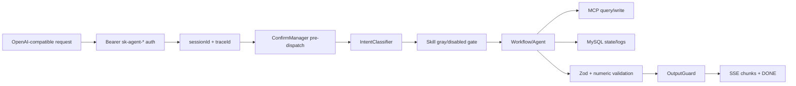

# 03. Runtime and Boundaries — 运行时与系统边界

## 1. Monorepo 组件边界

| 组件 | 角色 | 不能承担的职责 |
| --- | --- | --- |
| `@storepilot/agent-service` | 主服务：API、鉴权、session、dispatcher、workflow、安全、DB、MCP client。 | 不应内置 ERP 主数据事实。 |
| `@storepilot/shared-contracts` | 跨包 schema SSOT。 | 不写运行时业务逻辑。 |
| `@storepilot/mcp-mock-server` | dev/CI 的 ERP MCP mock。 | 生产不可运行，不代表真实 ERP 全能力。 |
| `migrations` | 本地表结构 SSOT。 | 不等于业务主数据模型全量。 |

## 2. HTTP/API 本体

| API | 语义 | 修改注意 |
| --- | --- | --- |
| `GET /health` | Liveness，不做 IO。 | 不要加入 DB/MCP 依赖。 |
| `GET /health/db` | DB 健康，执行 `SELECT 1` 和表数量检查。 | 表数量门槛和 migrations 要一致。 |
| `GET /health/mcp` | MCP 工具集合健康。 | 工具白名单变化必须同步。 |
| `GET /health/model` | 模型 ping，不纳入 readiness。 | 模型失败不应阻塞 readiness。 |
| `GET /health/ready` | DB + MCP readiness。 | 不包含 model。 |
| `POST /v1/chat/completions` | OpenAI-compatible SSE 对话入口。 | 拒绝 tools/function_call/response_format 等字段；输出要过 guard。 |

## 3. ChatCompletions 链路

## 4. 关键运行时对象

| 对象 | 职责 | 变更风险 |
| --- | --- | --- |
| Auth | Bearer API key 校验，派生 merchant/store/user。 | 高：租户安全。 |
| Session bridge | 维护 session 与 tenant/user 绑定。 | 高：会话漂移、草稿错配。 |
| ConfirmManager | HITL 挂起、确认、取消、抢占、过期、resume 锁。 | 高：重复提交/绕过确认。 |
| Dispatcher | Intent → Skill/Workflow 分发。 | 中高：能力路由。 |
| Skill registry | 校验 SkillDef、workflow、工具权限和灰度。 | 中高：启动一致性。 |
| MCPClient | 连接 ERP MCP，校验工具白名单和 schema。 | 高：数据源和写工具边界。 |
| OutputValidator | Zod schema 和数字一致性。 | 高：业务数据真实性。 |
| OutputGuard | 防止工具调用结构泄漏给前端。 | 高：协议安全。 |

## 5. 外部系统边界

- MCP/ERP 是销售、库存、SKU、供应商和采购单写入事实源。
- 本项目只通过白名单 MCP 工具访问 ERP 能力。
- MCP mock 仅用于开发和 CI；`NODE_ENV=production` 时禁止启动。
- 生产环境不能用 mock 结论替代真实 ERP 规则。

## 6. Env 边界

文档允许引用 env schema key，不允许输出 `.env.*` 的具体值。核心 env key 包括：`DATABASE_URL`、`ERP_MCP_SERVER_URL`、`MCP_TENANT_SHARED_SECRET`、`MODEL_API_KEY`、`MODEL_BASE_URL`、`MODEL_NAME`、`GRAY_MERCHANT_WHITELIST`、`SUSPEND_TTL_MINUTES` 等。
