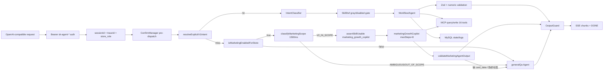

# 03. Runtime and Boundaries — 运行时与系统边界

## 1. Monorepo 组件边界

| 组件 | 角色 | 不能承担的职责 |
| --- | --- | --- |
| `@storepilot/agent-service` | 主服务：API、鉴权、session、dispatcher、workflow、安全、DB、MCP client。 | 不应内置 ERP 主数据事实。 |
| `@storepilot/shared-contracts` | 跨包 schema SSOT。 | 不写运行时业务逻辑。 |
| `@storepilot/mcp-mock-server` | dev/CI 的 ERP MCP mock。 | 生产不可运行，不代表真实 ERP 全能力。 |
| `migrations` | 本地表结构 SSOT。 | 不等于业务主数据模型全量。 |

## 2. HTTP/API 本体

| API | 语义 | 修改注意 |
| --- | --- | --- |
| `GET /health` | Liveness，不做 IO。 | 不要加入 DB/MCP 依赖。 |
| `GET /health/db` | DB 健康，执行 `SELECT 1` 和表数量检查。 | 表数量门槛和 migrations 要一致。 |
| `GET /health/mcp` | MCP 工具集合健康。 | 工具白名单变化必须同步。 |
| `GET /health/model` | 模型 ping，不纳入 readiness。 | 模型失败不应阻塞 readiness。 |
| `GET /health/ready` | DB + MCP readiness。 | 不包含 model。 |
| `POST /v1/chat/completions` | OpenAI-compatible SSE 对话入口。 | 拒绝 tools/function_call/response_format 等字段；输出要过 guard。 |

## 3. ChatCompletions 链路

V1 显式动作优先；未命中再走 V2 营销三段路由（默认 disabled，灰度逐店放量）。

## 4. 关键运行时对象

| 对象 | 职责 | 变更风险 |
| --- | --- | --- |
| Auth | Bearer API key 校验，派生 merchant/store/user/`store_role`（V2 加入）。 | 高：租户安全。 |
| Session bridge | 维护 session 与 tenant/user 绑定。 | 高：会话漂移、草稿错配。 |
| ConfirmManager | HITL 挂起、确认、取消、抢占、过期、resume 锁。 | 高：重复提交/绕过确认。 |
| **ExplicitV1CommandRouter（V2）** | `resolveExplicitV1Intent`：6 条 regex 优先识别 V1 显式动作；未命中才进入 V2 三段路由。详见 `cards/marketing_scope_router.md`。 | 中高：动一条 regex 可能让 V1/V2 流量错配。 |
| **MarketingGrayPolicy（V2）** | `isMarketingEnabledForStore`：env 总开关 + store whitelist + sha256(`merchantId:storeId`) rollout 桶；与 SkillDef 灰度叠加。详见 `cards/marketing_scope_router.md`。 | 中高：误开会把灰度商家暴露给 marketing。 |
| **MarketingScopeClassifier（V2）** | `classifyMarketingScope`：LLM 范围分类器，默认 1500ms 超时 / 非法 JSON 一律降级 `AMBIGUOUS+degraded=true`；含 V1 显式指令二次拦截。env schema 当前允许最高 10000ms，生产建议不超过 2000ms（见 `09_open_issues.md`）。详见 `cards/marketing_scope_router.md`。 | 中：动 prompt / examples / 候选 regex 必须配合 L2 评测重跑。 |
| **MarketingOutputGuard（V2）** | `validateMarketingAgentOutput`：目标语义是文本含 `<!-- card_data:start -->` 或存在真实工具调用；伪桥标签 `<ASK>`/`<FALLBACK>` 一律拒绝。当前 dispatcher 传入固定 `toolCallCount=1`，会弱化“缺 card_data”拦截（见 `09_open_issues.md`）。 | 高：守卫一旦放宽即可能让 prompt injection 进入老板视图。 |
| Dispatcher | Intent / 营销 scope → SkillDef/Workflow/Agent 分发。 | 中高：能力路由。 |
| Skill registry | 校验 SkillDef、workflow 注册项、工具权限和灰度；V2 Agent 形态还需对照 `AgentBundle` 真实执行入口与 wrapper，避免把 wrapper 当主链路。 | 中高：启动一致性。 |
| MCPClient | 连接 ERP MCP，校验 16 工具白名单（V1 7 + V2 9）和 schema。 | 高：数据源和写工具边界。 |
| **AgentBundle / ExternalSkillsWorkspace（V2）** | 启动期 `loadVerifiedExternalSkills → createExternalSkillWorkspace → createAgentBundle → createMastra({ agents })`；marketingGrowthCopilot 与 External Skills 隔离。 | 高：External Skills 加载必须 sha256/HTTPS allowlist/拒 symlink/灰度交集 fail-closed。 |
| OutputValidator | Zod schema 和数字一致性。 | 高：业务数据真实性。 |
| OutputGuard | 防止工具调用结构泄漏给前端。 | 高：协议安全。 |

## 5. 外部系统边界

- MCP/ERP 是销售、库存、SKU、供应商和采购单写入事实源。
- 本项目只通过白名单 MCP 工具访问 ERP 能力。
- MCP mock 仅用于开发和 CI；`NODE_ENV=production` 时禁止启动。
- 生产环境不能用 mock 结论替代真实 ERP 规则。

## 6. Env 边界

文档允许引用 env schema key，不允许输出 `.env.*` 的具体值。核心 env key（按子系统分组）：

### 6.1 基础设施 / 模型 / 鉴权

`DATABASE_URL`、`ERP_MCP_SERVER_URL`、`MCP_TENANT_SHARED_SECRET`、`MCP_PROTOCOL_VERSION`、`MODEL_PROVIDER`、`MODEL_API_KEY`、`MODEL_BASE_URL`、`MODEL_NAME`、`MODEL_TIMEOUT_MS`、`MAX_OUTPUT_TOKENS`、`MAX_TOOL_CALLS_PER_REQUEST`、`AGENT_TOOL_CALLS_PER_REQUEST_HARD_LIMIT`、`AGENT_API_KEY_HASH_SALT`、`AGENT_API_KEY_PREFIX`、`CORS_ALLOWED_ORIGINS`、`USER_MESSAGE_MAX_CHARS`。

### 6.2 V1 安全 / HITL / 健康

`GRAY_MERCHANT_WHITELIST`、`SUSPEND_TTL_MINUTES`、`RETENTION_DAYS_RUN_LOG`、`NUMBER_CONSISTENCY_CHECK_ENABLED`、`OTEL_EXPORTER_OTLP_ENDPOINT`、`TOOL_CALL_TIMEOUT_MS`、`DB_POOL_MAX`、`DB_QUEUE_LIMIT`。

### 6.3 V2 阶段二营销

| Env key | 语义 | 默认 |
| --- | --- | --- |
| `MARKETING_AGENT_ENABLED` | V2 营销总开关；false → 整条 V2 路径关闭。 | `false` |
| `MARKETING_AGENT_MAX_STEPS` | marketingGrowthCopilot 最大工具调用步数。 | `8`（不得 > 8） |
| `MARKETING_AGENT_ENABLED_STORE_WHITELIST` | 逗号分隔的 storeId 白名单。 | 空 |
| `MARKETING_AGENT_ROLLOUT_PERCENT` | sha256(`merchantId:storeId`) hash bucket < 该百分比则放量。 | `0` |
| `MARKETING_SCOPE_CLASSIFIER_TIMEOUT_MS` | scope classifier 超时阈值，超时降级 AMBIGUOUS。默认 `1500`；env schema 允许 `500..10000`，但生产建议上限 `2000`，否则 V2 LLM 分类故障会拖慢对话。 | `1500` |

### 6.4 V2 External Skills 受控加载（与 marketing 隔离）

`EXTERNAL_SKILLS_ENABLED`、`EXTERNAL_SKILLS_BASE_DIR`、`EXTERNAL_SKILLS_MANIFEST_PATH`、`EXTERNAL_SKILLS_ALLOWED_SOURCES`、`EXTERNAL_SKILLS_GRAY_MERCHANT_WHITELIST`、`EXTERNAL_SKILLS_ALLOW_SCRIPTS`（生产强制 false，env schema fail-fast）。

> 生产环境额外硬约束：CORS 不能 `*`、`NUMBER_CONSISTENCY_CHECK_ENABLED` 不能 false、`EXTERNAL_SKILLS_ALLOW_SCRIPTS` 不能 true。
