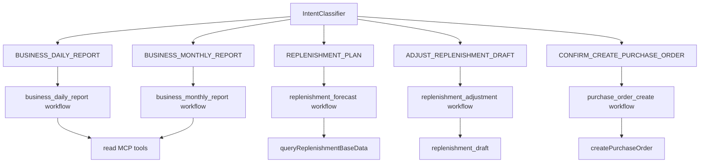
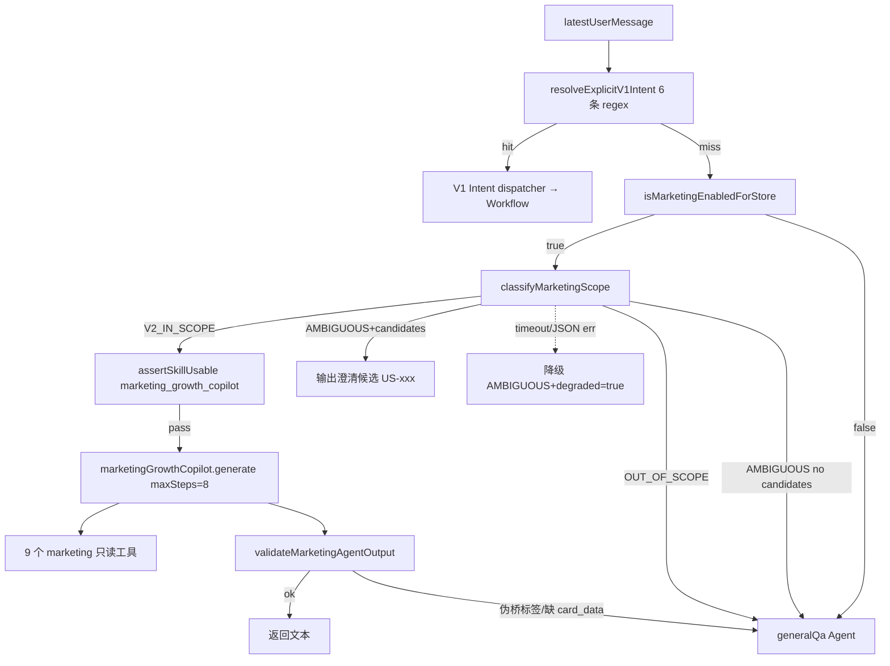

# 04. Skill / Intent / Workflow 本体

## 1. Intent 列表

V1/V2 共用 **11 个 Intent**；V2 阶段二**不**新增 Intent，营销路由复用 `GENERAL_QA` + scope classifier 三段决策（详见 §3.2 与 `cards/marketing_scope_router.md`）。

| Intent | 业务语义 | 默认方向 |
| --- | --- | --- |
| `BUSINESS_DAILY_REPORT` | 经营日报 | 读 MCP，生成日报。 |
| `BUSINESS_MONTHLY_REPORT` | 经营月报 | 读 MCP，生成月报。 |
| `REPLENISHMENT_PLAN` | 补货计划/预测 | 读补货基础数据，创建草稿。 |
| `ADJUST_REPLENISHMENT_DRAFT` | 调整补货草稿 | 修改本地草稿，不直接写 ERP。 |
| `CONFIRM_CREATE_PURCHASE_ORDER` | 确认创建采购单 | HIGH 风险，HITL 后写 ERP。 |
| `CANCEL_REPLENISHMENT_DRAFT` | 取消草稿/挂起采购 | 取消或清理 active run。 |
| `COLLECT_REQUIREMENT` | 需求收集 | V1 不写表。 |
| `GENERAL_QA` | 通用问答 / **V2 营销入口（经 scope 分类后）** | V1 走 generalQa Agent；V2 命中范围则改走 marketingGrowthCopilot。 |
| `EXPLAIN_METRIC` | 指标解释 | 不应编造数据。 |
| `MULTI_INTENT` | 多意图 | 友好拒绝或引导拆分。 |
| `UNKNOWN` | 低置信度 | 友好澄清。 |

## 2. SkillDef / Workflow / Agent 清单

`agent_skill_def.skill_code` 是运行时注册、灰度、回滚和工具白名单校验 ID。它不总等同于产品语义上的普通 Skill，主要有两种形态：

- **Workflow 形态**（V1 5 行）：`skill_code` ↔ Mastra Workflow id（`createMastra workflows barrel` 注册）；启动期 `verifySkillDef` 严格校验 set 相等（R-SKILL-001）。
- **Agent 形态**（V2 新增 1 行 `marketing_growth_copilot`）：`skill_code` ↔ dispatcher 显式调用的 `AgentBundle.marketingGrowthCopilot.generate(...)`；同样受 `required_tools` 严格校验和灰度网关。当前代码还注册了同名轻量 workflow wrapper，主要用于 Mastra/workflow 注册一致性，不承载真实营销业务执行。

| skill_code | 运行形态 | Risk | Status | Allowed Intents | Required Tools | 实现入口 |
| --- | --- | --- | --- | --- | --- | --- |
| `business_daily_report` | Workflow | LOW | enabled | BUSINESS_DAILY_REPORT, EXPLAIN_METRIC | getStoreReportConfig, sales, ratio, rank, inventory | `mastra/workflows/business-daily-report.ts` |
| `business_monthly_report` | Workflow | LOW | enabled | BUSINESS_MONTHLY_REPORT | sales, ratio, rank, inventory | `mastra/workflows/business-monthly-report.ts` |
| `replenishment_forecast` | Workflow | MEDIUM | enabled | REPLENISHMENT_PLAN | queryReplenishmentBaseData | `mastra/workflows/replenishment-forecast.ts` |
| `replenishment_adjustment` | Workflow（指令处理） | MEDIUM | enabled | ADJUST_REPLENISHMENT_DRAFT | 无 MCP；本地草稿调整 | `mastra/workflows/replenishment-adjustment.ts` |
| `purchase_order_create` | Workflow（HITL 确认） | HIGH | gray | CONFIRM, CANCEL | createPurchaseOrder | `mastra/workflows/purchase-order-create.ts` |
| `marketing_growth_copilot`（V2） | **Mastra Agent**（maxSteps=8）+ 轻量 workflow wrapper | MEDIUM | gray | GENERAL_QA（经 scope 路由命中） | query_member_profile / query_member_consumption_history / query_member_segments / query_repurchase_cycle / query_product_performance / query_inventory_status / query_pos_summary_by_time / query_campaign_history / query_coupon_inventory（9 个 marketing 只读工具） | 真实执行：`mastra/agents/marketing-growth-copilot.ts`；注册 wrapper：`mastra/workflows/marketing-growth-copilot.ts` |

V2 `marketing_growth_copilot` 是受限 Mastra Agent 形态，不属于 V1 高风险 workflow 集合：入口必须经过 V1 显式指令优先、店铺级灰度和 scope classifier；运行时最多 8 步，只能使用 9 个只读 marketing MCP 工具。

## 3. 分发关系

### 3.1 V1 显式动作分发（基于 IntentEnum）

V1 显式指令在 `business-report-dispatcher.ts` 中通过 `resolveExplicitV1Intent` 优先识别；命中后走原 11 IntentEnum + Skill 网关分发。



### 3.2 V2 营销三段路由（V1 显式动作未命中时）



要点（与 `cards/marketing_scope_router.md` 一一对应）：

- **店铺级灰度**：`MARKETING_AGENT_ENABLED=false`（默认）→ V2 整条路径关闭；`true` 时按 `MARKETING_AGENT_ENABLED_STORE_WHITELIST` + sha256 `(merchantId:storeId)` rollout 桶 < `MARKETING_AGENT_ROLLOUT_PERCENT` 逐店放量（R-V2-SCOPE-001）。
- **scope classifier 默认 1500ms 超时**：`MARKETING_SCOPE_CLASSIFIER_TIMEOUT_MS` 控制；超时 / 非法 JSON 一律降级 `AMBIGUOUS+degraded=true`，不会让模型故障打挂对话。env schema 当前允许最高 10000ms，生产建议 ≤2000ms，见 `09_open_issues.md`。
- **assertSkillUsable**：V2 在 scope 命中后单独调用 `assertSkillUsable('marketing_growth_copilot', merchantId)`；它不经过 `INTENT_TO_SKILL` 表（该表仍只覆盖 V1 IntentEnum），但仍复用 `agent_skill_def.status='gray'` + `GRAY_MERCHANT_WHITELIST` 网关，并与店铺级灰度叠加生效，**任一不放行即拒绝**。
- **OutputGuard 降级**：marketing 输出含 `<ASK>`/`<FALLBACK>` 伪桥标签会立即回落 generalQa；目标语义还要求缺 `<!-- card_data:start -->` 且无真实工具调用时降级。当前 dispatcher 固定传 `toolCallCount=1`，缺 card_data 的拦截会被弱化，作为红队待治理项记录在 `09_open_issues.md`。

## 4. SkillDef 一致性规则

`agent_skill_def`、workflow barrel、dispatcher、AgentBundle 和 shared contracts 之间必须保持一致：

- **Workflow 形态 SkillDef**：`skill_code` ↔ Mastra Workflow id；启动期 `verifySkillDef` 校验 `set(workflow barrel ids) === set(enabled∪gray skill_code)`；任一缺失/多余/必备 Skill 被 disabled 都会抛 `SkillDefMismatchError` 并 `process.exit(1)`。
- **Agent 形态 SkillDef**（V2 新增 `marketing_growth_copilot`）：`skill_code` ↔ dispatcher 显式调用的 `AgentBundle.marketingGrowthCopilot.generate`；`required_tools` 仍按 R-MCP-001 严格校验。当前代码同时注册 `marketing_growth_copilot` 轻量 workflow wrapper，wrapper 只返回路由标记，不执行真实营销业务；不要把 wrapper 当成营销执行主链路。
- 修改 workflow id、V2 Agent 执行入口或 wrapper 名称：必须同步 `agent_skill_def`、dispatcher 和证据索引；V1 workflow 不一致会启动期失败，V2 Agent 形态目前还需要人工/测试守住 wrapper 与真实执行链路。
- 修改 MCP 工具：必须同步 `SkillDef.required_tools` + V2 marketing 同步 `MARKETING_GROWTH_TOOLS` 数组。
- `disabled` 一律不可用；`gray` 只有 `GRAY_MERCHANT_WHITELIST` 命中商家可用；V2 marketing 还要叠加 `MARKETING_AGENT_ENABLED_STORE_WHITELIST` / rollout。

## 5. 当前重点事实

`replenishment_adjustment` workflow 已实现并有 SkillDef，dispatcher 对 `ADJUST_REPLENISHMENT_DRAFT` 已接入以下步骤：

- `loadActiveDraftStep`：按 session / tenant 上下文加载活跃草稿；
- `extractInstructionStep`：从用户自然语言抽取结构化调整指令；
- `applyInstructionStep`：在本地草稿项上应用调整，不直接写 ERP；
- `persistAdjustmentStep`：更新草稿并写 `replenishment_adjustment_log` 审计。

继续修改该能力时，仍要重点测试租户隔离、草稿状态、最大调整次数、审计日志和数字一致性。

## 6. 新增能力时的最小检查表

### 6.1 新增 Workflow 形态 Skill（V1 风格）

```text
1. 是否已有 Intent？没有则改 shared-contracts/src/intents.ts。
2. 改 agent_skill_def seed（migrations）+ Skill schema（shared-contracts）。
3. 是否需要 MCP 工具？先改 shared-contracts/mcp，再改 mock/client/health。
4. workflow 实现 + barrel 导出，workflow id 必须与 SkillDef 严格一致。
5. dispatcher 在 IntentEnum 分支接入，过 assertSkillUsable 灰度网关。
6. 是否涉及数字输出？接 OutputValidator + 数字一致性校验。
7. 是否涉及写操作？必须 HITL + 幂等 + 审计。
```

### 6.2 新增 Agent 形态 Skill（V2 风格）

```text
1. 是否能复用现有 Intent？V2 默认复用 GENERAL_QA + scope 路由，不新增 IntentEnum。
2. shared-contracts/mcp/<new>.ts 定义只读工具 schema（强烈建议保持 0 写工具）。
3. mcp-mock-server 新增 handler + fixture；MCPClient 白名单同步；
   marketing-growth-copilot.ts 等价的 *_TOOLS 数组同步。
4. mastra/agents/<copilot>.ts 编写指令 + builder + AgentBundle 注入；
   maxSteps 必须≤ MAX_TOOL_CALLS_PER_REQUEST_HARD_LIMIT。
5. agent_skill_def seed（新 migration）+ status 默认 gray + required_tools 严格列出。
6. dispatcher 新增 scope classifier 候选 + 灰度策略；保留 V1 显式动作优先。
7. 输出守卫：定义 card_data 结构 + 伪桥标签拒绝；缺失立即降级 generalQa。
8. PII：所有姓名/手机用 masked 字段；指令显式声明禁止反脱敏与暴露 traceId 类元数据。
9. eval：新增 L2/L3/L4 redline 用例，并确认 phase2 eval runner / 项目 CI 会执行这些用例。
10. 文档：同步 02 域模型、04 此文档、05 工具表、06 数据表（若新增本地表）、
    07 加 R-V2-* 规则、cards/ 新加场景卡。
```

### 6.3 新增 US-xxx 营销用例（不动 Agent / 工具，只加规则）

```text
1. marketing/phase2/us-display-names.ts：US 编码 + 中文展示名。
2. marketing-scope-classifier.ts inferCandidate：关键词 regex → US 候选。
3. scripts/scope-classifier-examples.json：增加正/反例覆盖 IN/AMBI/OUT 分布。
4. marketing/phase2/<scenario>-rules.ts + -output.markdown.test.ts：
   规则引擎 + 输出格式 + 单元测试。
5. test/eval/phase2/l2-cases.us0xx.json / l3-cases.us0xx.json / l4-redline.us0xx.test.ts。
6. AI_ONTOLOGY.md §8 与 09_open_issues.md 更新 US 实现进度。
```
