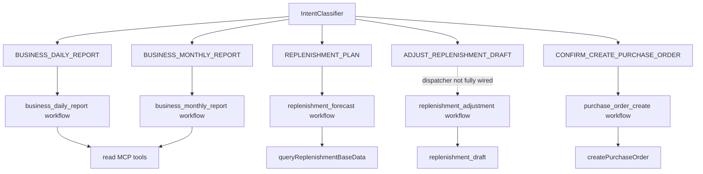

# 04. Skill / Intent / Workflow 本体

## 1. Intent 列表

| Intent | 业务语义 | 默认方向 |
| --- | --- | --- |
| `BUSINESS_DAILY_REPORT` | 经营日报 | 读 MCP，生成日报。 |
| `BUSINESS_MONTHLY_REPORT` | 经营月报 | 读 MCP，生成月报。 |
| `REPLENISHMENT_PLAN` | 补货计划/预测 | 读补货基础数据，创建草稿。 |
| `ADJUST_REPLENISHMENT_DRAFT` | 调整补货草稿 | 修改本地草稿，不直接写 ERP。 |
| `CONFIRM_CREATE_PURCHASE_ORDER` | 确认创建采购单 | HIGH 风险，HITL 后写 ERP。 |
| `CANCEL_REPLENISHMENT_DRAFT` | 取消草稿/挂起采购 | 取消或清理 active run。 |
| `COLLECT_REQUIREMENT` | 需求收集 | V1 不写表。 |
| `GENERAL_QA` | 通用问答 | 解释/兜底。 |
| `EXPLAIN_METRIC` | 指标解释 | 不应编造数据。 |
| `MULTI_INTENT` | 多意图 | 友好拒绝或引导拆分。 |
| `UNKNOWN` | 低置信度 | 友好澄清。 |

## 2. Skill 清单

| Skill Code | Risk | Status | Allowed Intents | Required Tools | Workflow |
| --- | --- | --- | --- | --- | --- |
| `business_daily_report` | LOW | enabled | DAILY, EXPLAIN_METRIC | getStoreReportConfig, sales, ratio, rank, inventory | `business_daily_report` |
| `business_monthly_report` | LOW | enabled | MONTHLY | sales, ratio, rank, inventory | `business_monthly_report` |
| `replenishment_forecast` | MEDIUM | enabled | REPLENISHMENT_PLAN | queryReplenishmentBaseData | `replenishment_forecast` |
| `replenishment_adjustment` | MEDIUM | enabled | ADJUST_REPLENISHMENT_DRAFT | 无 MCP；本地草稿调整 | `replenishment_adjustment` |
| `purchase_order_create` | HIGH | gray | CONFIRM, CANCEL | createPurchaseOrder | `purchase_order_create` |

## 3. 分发关系



## 4. SkillDef 一致性规则

`agent_skill_def`、workflow barrel、dispatcher 和 shared contracts 之间必须保持一致：

- 新增 Skill：必须有 skill seed、workflow id、required tools、allowed intents、risk/status、测试。
- 修改 workflow id：必须同步 SkillDef；否则启动期一致性校验失败。
- 修改 MCP 工具：必须同步 SkillDef.required_tools。
- `disabled` 一律不可用；`gray` 只有白名单商家可用。

## 5. 当前重点差异

`replenishment_adjustment` workflow 已实现并有 SkillDef，但 dispatcher 对 `ADJUST_REPLENISHMENT_DRAFT` 仍返回“尚未完整接入桥接层”。所以：

- 设计上它是 V1 能力之一；
- 实现上 workflow 已存在；
- 对话入口分发仍需确认是否正式接入；
- 若要接入，要重点测试租户隔离、草稿状态、最大调整次数、审计日志。

## 6. 新增能力时的最小检查表

```text
1. 是否已有 Intent？没有则改 shared-contracts/src/intents.ts。
2. 是否需要新 Skill？改 agent_skill_def seed + Skill schema。
3. 是否需要 MCP 工具？先改 shared-contracts/mcp，再改 mock/client/health。
4. 是否有 workflow？workflow id 必须与 SkillDef 一致。
5. 是否需要 dispatcher 接入？确认灰度、禁用、低置信度路径。
6. 是否涉及数字输出？接 OutputValidator。
7. 是否涉及写操作？必须 HITL + 幂等 + 审计。
```
