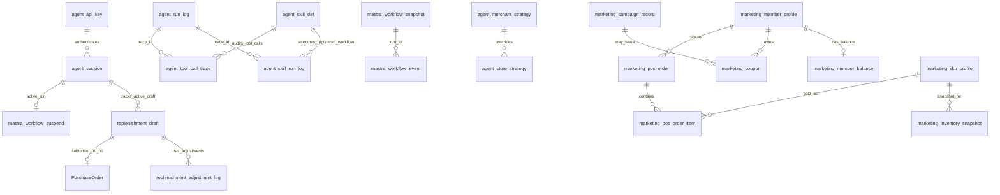

# 06. Data Persistence — 数据表与持久化本体

## 1. 当前本地表角色

本地 MySQL 主要保存 Agent 运行态、策略、草稿、会话、审计、workflow 状态；V2 阶段二额外保存"营销事实快照"（会员/POS/券/活动/SKU 维度/库存维度），仍以 ERP/MCP 为权威，本地是结构化派生层。

### 1.1 V1 Agent 运行态 / 安全 / 审计

| 表 | 本体角色 | 关键语义 |
| --- | --- | --- |
| `agent_skill_def` | SkillDef 注册元数据（V1 5 行 + V2 1 行） | skill_code、allowed_intents、required_tools、risk_level、status；`skill_code` 是运行时稳定守门 ID。V1 对齐 Workflow id；V2 `marketing_growth_copilot` 对齐受限 Agent 执行入口，并配有轻量 workflow wrapper。 |
| `agent_merchant_strategy` | 平台/商家策略 | 平台默认和商家级策略 JSON。 |
| `agent_store_strategy` | 门店策略 | Store 级覆盖，优先级最高。 |
| `replenishment_draft` | 补货草稿 | status、items、strategy_version、expires_at、submitted_po_no。 |
| `replenishment_adjustment_log` | 调整审计 | before/after items、instruction_json、affected_sku_ids。 |
| `agent_run_log` | Agent 请求审计 | trace/session/tenant/intent/status/error/duration。 |
| `agent_skill_run_log` | Skill 执行审计 | trace/skill/input/output summary/status。 |
| `agent_api_key` | API key 租户绑定 | prefix、hash、merchant/store/user、status；**V2 加入 `store_role`（默认 `BOSS`，migration 018）**。 |
| `strategy_invalidation` | 策略缓存失效 | StrategyEngine reload 信号。 |
| `agent_session` | 会话与 HITL 状态 | active_draft/run/step/expires/lock。 |
| `mastra_workflow_snapshot` | workflow 快照 | workflow_name + run_id。 |
| `mastra_workflow_event` | workflow 事件 | run/step/event_type/payload。 |
| `mastra_workflow_suspend` | HITL suspend payload | run_id + step_id + expires_at。 |

### 1.2 V2 营销事实快照（migrations 012-016）

> 这些表都是**店铺级（merchant_id + store_id 复合）唯一约束**；不要直接拿 `member_id` 等业务键单独查。

| 表 | 本体角色 | 关键语义 |
| --- | --- | --- |
| `marketing_member_profile` | 会员主档 | level/status/joinDate/lastVisitAt/total_spent/total_orders/avg_order_value/avg_repurchase_days；姓名/手机均为 masked。 |
| `marketing_member_balance` | 会员积分/储值/券摘要 | points/points_expiring_in_30d/storage_balance/total_recharged/total_consumed。 |
| `marketing_pos_order` | POS 订单事实 | order_time/sales_amount/item_count/member_id（散客为空）。 |
| `marketing_pos_order_item` | POS 订单行项 | sku_id/quantity/sales_amount/gross_margin_rate。 |
| `marketing_coupon` | 券实例 | coupon_type(CASH/DISCOUNT/GIFT/EXCHANGE)/amount/discount/threshold/valid_from-valid_to/status(UNUSED/USED/EXPIRED)/used_at/used_in_order_id。 |
| `marketing_campaign_record` | 活动结果 | touched/converted/sales/margin/result_summary 等（详见 migration 015）。 |
| `marketing_sku_profile` | SKU 营销维度 | cost/margin_rate/shelf_life_days/lifecycle_stage。 |
| `marketing_inventory_snapshot` | 营销库存快照 | available_qty/stock_age_days/near_expiry_days/slow_moving_flag/inventory_status(IN_STOCK/LOW_STOCK/OUT_OF_STOCK/SLOW_MOVING/NEAR_EXPIRY/PHASE_OUT)。 |

### 1.3 V2 工具调用审计（migration 017）

| 表 | 本体角色 | 关键语义 |
| --- | --- | --- |
| `agent_tool_call_trace` | 每次 MCP 工具调用的审计 | trace_id/agent_run_id/merchant/store/user/session/step_index/tool_call_index/tool_name/input_args_json/output_summary/elapsed_ms/success/error_code/occurred_at。 |

> **当前状态**：表已建（17），但运行时尚未接通写入路径，记入 `09_open_issues.md` `D-AGENT-TOOL-CALL-TRACE-NOT-WIRED`。规划写入时优先在 marketingGrowthCopilot 的工具 wrapper 内打点（参考 `buildMarketingToolsForRuntime.execute`）。

## 2. 数据关系图

V1 / V2 同图（V2 营销表均以 `merchant_id + store_id` 复合外键语义挂在租户上下文里，不与 V1 表有外键引用）：



## 3. 迁移规则

新增或修改 migration 前先检查：

```text
1. migration 编号是否唯一？历史 011 双胞胎不再扩大；V2 已使用 012-018，
   下一个 V2/V3 migration 从 019 起。
2. 是否影响 /health/db 表数量门槛？V2 已上 8 张新表（含 agent_tool_call_trace）。
3. 是否需要 tenant 字段 merchant_id/store_id/user_id？
4. 是否需要 trace_id/session_id 方便审计？V2 工具调用建议同步写 agent_tool_call_trace。
5. 是否需要状态机，而不只是状态字符串？
6. 是否需要过期索引、recent fallback 索引、幂等约束？
7. 是否要同步 shared-contracts 的 schema？（V2 marketing 表的语义必须与
   `packages/shared-contracts/src/mcp/marketing.ts` 保持一致。）
8. 是否要同步文档和测试？V2 还需同步 Phase2 evals / runner / L2-L4 redline 用例。
```

## 4. ReplenishmentDraft 状态语义

状态集合：`DRAFT`、`WAIT_CONFIRM`、`CONFIRMED`、`SUBMITTED`、`EXPIRED`、`CANCELLED`、`FAILED`。

允许流转：

```text
DRAFT -> WAIT_CONFIRM | CANCELLED | EXPIRED
WAIT_CONFIRM -> CONFIRMED | CANCELLED | EXPIRED
CONFIRMED -> SUBMITTED | FAILED | CANCELLED
SUBMITTED/FAILED/CANCELLED/EXPIRED -> terminal
```

任何修改 `replenishment_draft.status` 的代码都应通过 DraftManager 语义，而不是随手 SQL 更新。

## 5. Session/HITL 语义

`agent_session` 保存 active draft/run/step/expires/lock。它不是普通会话缓存，而是采购单 HITL 和草稿恢复的关键状态。

高风险修改包括：

- 改 active_run 读写逻辑；
- 改 session 与 tenant/user 绑定；
- 改过期清理；
- 改 resume 锁；
- 取消或确认路径绕过 ConfirmManager。

## 6. 审计原则

- `agent_run_log` 不存原始用户消息，只存长度和运行元数据。
- `agent_skill_run_log` 存 input/output summary，不应扩大为敏感原文堆积。
- 调整草稿必须写 adjustment log，保留 before/after 和结构化指令。
