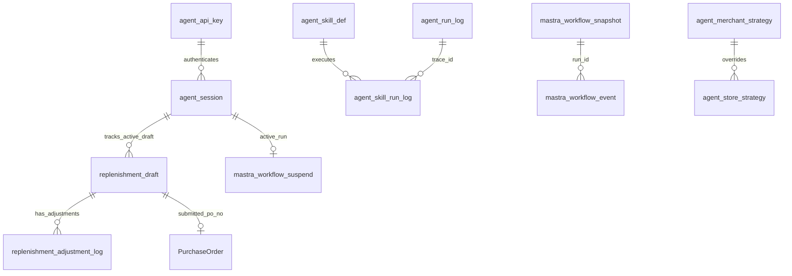

# 06. Data Persistence — 数据表与持久化本体

## 1. 当前本地表角色

本地 MySQL 主要保存 Agent 运行态、策略、草稿、会话、审计和 workflow 状态，不保存完整 ERP 主数据。

| 表 | 本体角色 | 关键语义 |
| --- | --- | --- |
| `agent_skill_def` | Skill 元数据 | skill_code、allowed_intents、required_tools、risk_level、status。 |
| `agent_merchant_strategy` | 平台/商家策略 | 平台默认和商家级策略 JSON。 |
| `agent_store_strategy` | 门店策略 | Store 级覆盖，优先级最高。 |
| `replenishment_draft` | 补货草稿 | status、items、strategy_version、expires_at、submitted_po_no。 |
| `replenishment_adjustment_log` | 调整审计 | before/after items、instruction_json、affected_sku_ids。 |
| `agent_run_log` | Agent 请求审计 | trace/session/tenant/intent/status/error/duration。 |
| `agent_skill_run_log` | Skill 执行审计 | trace/skill/input/output summary/status。 |
| `agent_api_key` | API key 租户绑定 | prefix、hash、merchant/store/user、status。 |
| `strategy_invalidation` | 策略缓存失效 | StrategyEngine reload 信号。 |
| `agent_session` | 会话与 HITL 状态 | active_draft/run/step/expires/lock。 |
| `mastra_workflow_snapshot` | workflow 快照 | workflow_name + run_id。 |
| `mastra_workflow_event` | workflow 事件 | run/step/event_type/payload。 |
| `mastra_workflow_suspend` | HITL suspend payload | run_id + step_id + expires_at。 |

## 2. 数据关系图



## 3. 迁移规则

新增或修改 migration 前先检查：

```text
1. migration 编号是否唯一？当前已有两个 011-*，后续要避免继续混淆。
2. 是否影响 /health/db 表数量门槛？
3. 是否需要 tenant 字段 merchant_id/store_id/user_id？
4. 是否需要 trace_id/session_id 方便审计？
5. 是否需要状态机，而不只是状态字符串？
6. 是否需要过期索引、recent fallback 索引、幂等约束？
7. 是否要同步 shared-contracts 的 schema？
8. 是否要同步文档和测试？
```

## 4. ReplenishmentDraft 状态语义

状态集合：`DRAFT`、`WAIT_CONFIRM`、`CONFIRMED`、`SUBMITTED`、`EXPIRED`、`CANCELLED`、`FAILED`。

允许流转：

```text
DRAFT -> WAIT_CONFIRM | CANCELLED | EXPIRED
WAIT_CONFIRM -> CONFIRMED | CANCELLED | EXPIRED
CONFIRMED -> SUBMITTED | FAILED | CANCELLED
SUBMITTED/FAILED/CANCELLED/EXPIRED -> terminal
```

任何修改 `replenishment_draft.status` 的代码都应通过 DraftManager 语义，而不是随手 SQL 更新。

## 5. Session/HITL 语义

`agent_session` 保存 active draft/run/step/expires/lock。它不是普通会话缓存，而是采购单 HITL 和草稿恢复的关键状态。

高风险修改包括：

- 改 active_run 读写逻辑；
- 改 session 与 tenant/user 绑定；
- 改过期清理；
- 改 resume 锁；
- 取消或确认路径绕过 ConfirmManager。

## 6. 审计原则

- `agent_run_log` 不存原始用户消息，只存长度和运行元数据。
- `agent_skill_run_log` 存 input/output summary，不应扩大为敏感原文堆积。
- 调整草稿必须写 adjustment log，保留 before/after 和结构化指令。
