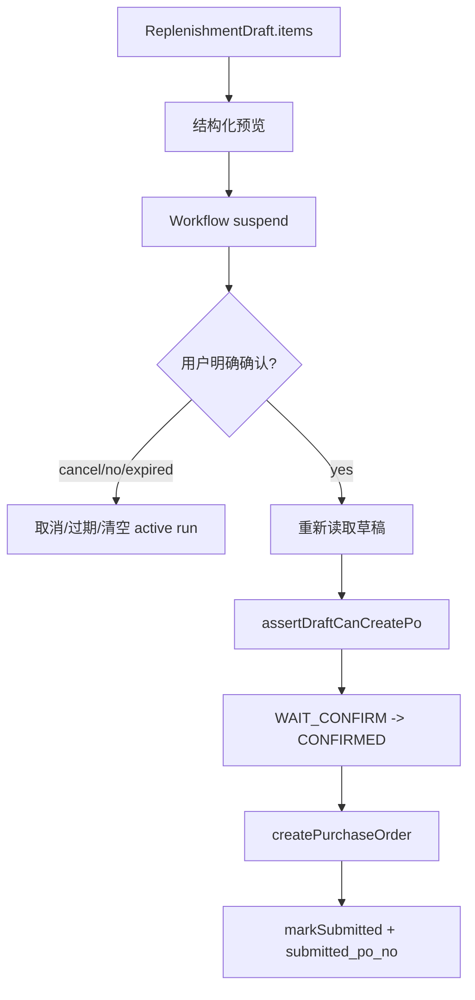

# 07. Guardrails — 业务规则与安全红线

## 1. 规则总表

| ID | 规则 | 编码含义 |
| --- | --- | --- |
| R-AI-001 | 不能编造业务数据。 | 销售、库存、SKU、采购数量来自 MCP、草稿或确定性计算。 |
| R-AI-002 | 创建采购单必须确认。 | 用户明确确认前不能调用 `createPurchaseOrder`。 |
| R-AI-003 | 不能从 Markdown 反解析提单。 | PO 明细只能来自 `ReplenishmentDraft.items`。 |
| R-SEC-001 | 商家/门店硬隔离。 | SQL、MCP、session、draft 必须绑定 tenant。 |
| R-STR-001 | 策略合并 Store > Merchant > Platform。 | 不要绕过 StrategyEngine。 |
| R-STR-002 | 禁止自动采购单。 | `allowAutoPurchaseOrder=false` 不可改成 true。 |
| R-STR-003 | 写操作必须用户确认。 | `requireUserConfirmForWrite=true` 不可绕过。 |
| R-SKILL-001 | SkillDef 与 Workflow 严格一致。 | 启动期不一致应失败。 |
| R-SKILL-002 | 灰度/禁用网关。 | gray 需白名单；disabled 不可用。 |
| R-MCP-001 | MCP 工具白名单严格相等。 | 工具漂移要启动失败。 |
| R-HTTP-001 | Chat Completions 请求不允许工具调用字段。 | 拒绝 tools/tool_choice/functions/function_call。 |
| R-OUT-001 | 禁止工具调用泄漏给前端。 | OutputGuard 必须保留。 |
| R-NUM-001 | 数字一致性校验。 | 不用 LLM judge 验数字。 |
| R-DRAFT-001 | 草稿 7 状态机。 | 不允许终态复活或跳过 WAIT_CONFIRM。 |
| R-DRAFT-002 | 草稿过期与最近草稿兜底。 | 保持 30 分钟过期与 recent fallback 语义。 |
| R-HITL-001 | HITL resume 互斥锁。 | 防止并发确认重复提交。 |
| R-PO-001 | 采购单幂等键。 | `idempotencyKey === sourceDraftId`。 |
| R-OPS-001 | 健康检查语义。 | `/health` 不做 IO；ready 聚合 DB+MCP。 |
| R-OPS-002 | 优雅停机顺序。 | 等 SSE、abort inflight、释放 MCP/DB。 |
| R-ENV-001 | 生产 CORS/数字校验保护。 | 生产不能 CORS `*`，不能关闭数字校验。 |
| R-MOCK-001 | Mock 服务生产禁用。 | `mcp-mock-server` production 必须退出。 |

## 2. 高风险判定

| 触碰内容 | 风险 | 必须检查 |
| --- | --- | --- |
| `createPurchaseOrder`、采购单、确认/取消 | HIGH | R-AI-002, R-AI-003, R-HITL-001, R-PO-001 |
| `replenishment_draft` 状态/SQL | HIGH | R-DRAFT-001, R-SEC-001 |
| API key、session、merchant/store/user | HIGH | R-SEC-001 |
| MCP 工具名/schema/mock/client | HIGH | R-MCP-001, R-SKILL-001 |
| 报表/补货数字输出 | MEDIUM/HIGH | R-AI-001, R-NUM-001 |
| SSE 输出、OpenAI-compatible bridge | MEDIUM/HIGH | R-HTTP-001, R-OUT-001 |
| SkillDef、workflow id、dispatcher | MEDIUM | R-SKILL-001, R-SKILL-002 |

## 3. 采购单安全闭环

任何“为了方便”直接从最后展示的 markdown 里提取商品和数量创建采购单，都是违反 R-AI-003。

## 4. 数字真实性规则

- 报表数值来自 MCP 工具输出。
- 补货建议数量来自确定性计算和策略参数。
- 调整后的最终数量来自结构化调整指令与草稿 items。
- 输出时可解释和汇总，但不能新造数字。
- 数字一致性校验不应替换成 LLM 判断。

## 5. 租户隔离规则

任何读取或更新以下对象时，都应绑定 merchantId/storeId/userId 或至少绑定可追溯 tenant scope：

- `agent_session`
- `replenishment_draft`
- `replenishment_adjustment_log`
- strategy 表
- MCP 请求 header/scope
- agent run/skill run 审计

不要只根据 `draft_id` 或 `session_id` 执行业务动作，除非调用链中已经严格验证了 tenant。
