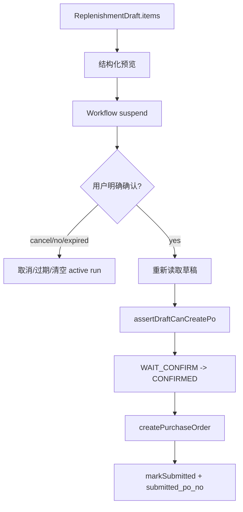
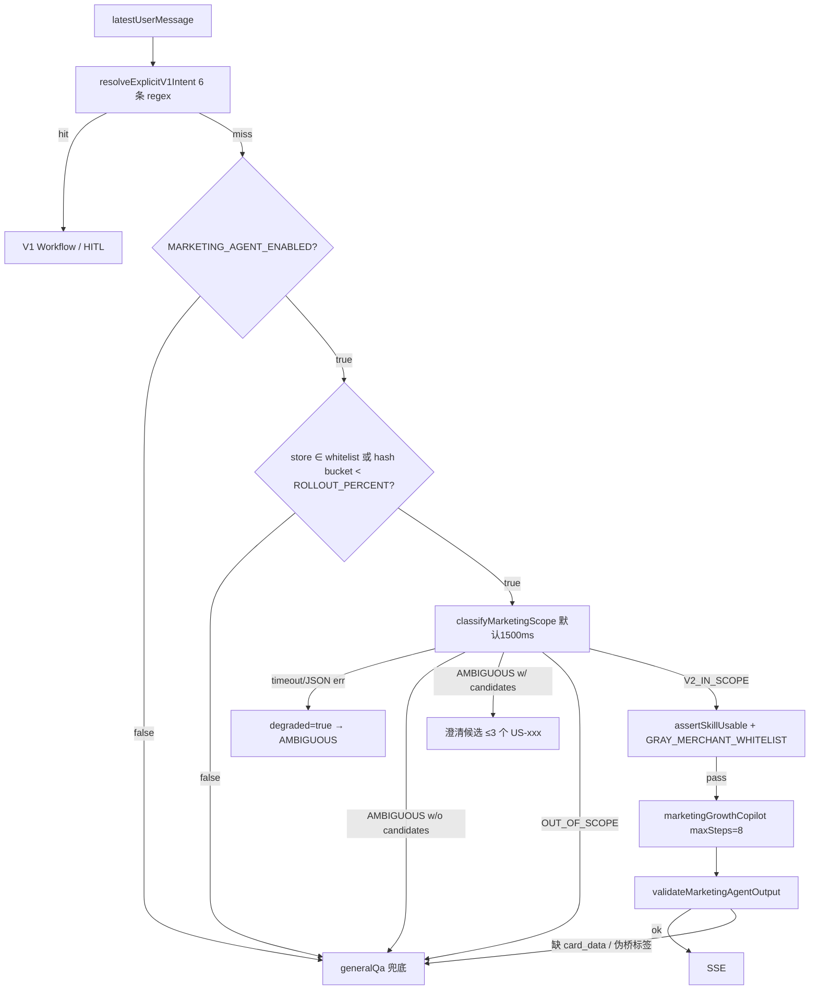

# 07. Guardrails — 业务规则与安全红线

## 1. 规则总表

### 1.1 V1 通用红线

| ID | 规则 | 编码含义 |
| --- | --- | --- |
| R-AI-001 | 不能编造业务数据。 | 销售、库存、SKU、采购数量、会员/券/活动数字均来自 MCP、草稿或确定性计算。 |
| R-AI-002 | 创建采购单必须确认。 | 用户明确确认前不能调用 `createPurchaseOrder`。 |
| R-AI-003 | 不能从 Markdown 反解析提单。 | PO 明细只能来自 `ReplenishmentDraft.items`。 |
| R-SEC-001 | 商家/门店硬隔离。 | SQL、MCP、session、draft、marketing 表必须绑定 tenant。 |
| R-STR-001 | 策略合并 Store > Merchant > Platform。 | 不要绕过 StrategyEngine。 |
| R-STR-002 | 禁止自动采购单。 | `allowAutoPurchaseOrder=false` 不可改成 true。 |
| R-STR-003 | 写操作必须用户确认。 | `requireUserConfirmForWrite=true` 不可绕过。 |
| R-SKILL-001 | SkillDef 与 Workflow / Agent 执行入口保持一致。 | V1 workflow 启动期 `verifySkillDef` 不一致应 fail-fast；V2 Agent 形态需显式对齐 `AgentBundle` 执行入口、wrapper 和 dispatcher。 |
| R-SKILL-002 | 灰度/禁用网关。 | gray 需 `GRAY_MERCHANT_WHITELIST`；disabled 不可用。 |
| R-MCP-001 | MCP 工具白名单严格相等（V1 7 + V2 9 = 16）。 | 工具漂移要启动失败；marketing 工具数组同步 `MARKETING_GROWTH_TOOLS`。 |
| R-HTTP-001 | Chat Completions 请求不允许工具调用字段。 | 拒绝 tools/tool_choice/functions/function_call/response_format。 |
| R-OUT-001 | 禁止工具调用泄漏给前端。 | OutputGuard 必须保留。 |
| R-NUM-001 | 数字一致性校验。 | 不用 LLM judge 验数字。 |
| R-DRAFT-001 | 草稿 7 状态机。 | 不允许终态复活或跳过 WAIT_CONFIRM。 |
| R-DRAFT-002 | 草稿过期与最近草稿兜底。 | 保持 30 分钟过期与 recent fallback 语义。 |
| R-HITL-001 | HITL resume 互斥锁。 | 防止并发确认重复提交。 |
| R-PO-001 | 采购单幂等键。 | `idempotencyKey === sourceDraftId`。 |
| R-OPS-001 | 健康检查语义。 | `/health` 不做 IO；ready 聚合 DB+MCP。 |
| R-OPS-002 | 优雅停机顺序。 | 等 SSE、abort inflight、释放 MCP/DB。 |
| R-ENV-001 | 生产 CORS/数字校验保护。 | 生产不能 CORS `*`，不能关闭数字校验。 |
| R-MOCK-001 | Mock 服务生产禁用。 | `mcp-mock-server` production 必须退出。 |

### 1.2 V2 阶段二营销红线

| ID | 规则 | 编码含义 |
| --- | --- | --- |
| R-V2-AGENT-001 | `marketingGrowthCopilot` 工具与步骤上限。 | 最多 8 步（`MARKETING_AGENT_MAX_STEPS` ≤ `AGENT_TOOL_CALLS_PER_REQUEST_HARD_LIMIT=8`）；只能用 `MARKETING_GROWTH_TOOLS` 9 个只读工具；**禁调** `createPurchaseOrder`，不发券、不改库存、不改价、不改积分。 |
| R-V2-PII-001 | 老板可见输出强制脱敏。 | 只允许 `nameMasked`/`phoneMasked`；禁止输出完整姓名、完整手机号、身份证、邮箱、地址，禁止 `traceId`/`merchantId`/`storeId`/`agent_run_id` 等内部元数据。 |
| R-V2-SCOPE-001 | V2 流量必须经三段路由。 | 顺序：`resolveExplicitV1Intent`（V1 显式优先）→ `isMarketingEnabledForStore`（店铺级灰度：env + whitelist + sha256 rollout 桶）→ `classifyMarketingScope`（默认 1500ms 超时即降级 `AMBIGUOUS+degraded=true`；生产建议 ≤2000ms）。任何路径不得绕过三段直达 marketingGrowthCopilot。 |
| R-V2-OUTPUT-001 | marketing Agent 输出守卫。 | 目标语义：文本必须含 `<!-- card_data:start -->` 或存在真实工具调用；含伪桥标签 `<ASK>` / `<FALLBACK>` 立即降级 generalQa。当前 dispatcher 固定传 `toolCallCount=1` 的风险见 `09_open_issues.md`。 |
| R-V2-EXT-SKILL-001 | External Skills 不进 marketing。 | `marketingGrowthCopilot` 禁止加载 External Skills；External Skills 在生产强制只读（`tools.enabled=false`）+ 禁脚本（`EXTERNAL_SKILLS_ALLOW_SCRIPTS=false`）+ sha256/HTTPS allowlist + 灰度交集 fail-closed。 |

## 2. 高风险判定

| 触碰内容 | 风险 | 必须检查 |
| --- | --- | --- |
| `createPurchaseOrder`、采购单、确认/取消 | HIGH | R-AI-002, R-AI-003, R-HITL-001, R-PO-001 |
| `replenishment_draft` 状态/SQL | HIGH | R-DRAFT-001, R-SEC-001 |
| API key、session、merchant/store/user、`store_role` | HIGH | R-SEC-001 |
| MCP 工具名/schema/mock/client（V1 7 + V2 9 = 16） | HIGH | R-MCP-001, R-SKILL-001 |
| 报表/补货数字输出 | MEDIUM/HIGH | R-AI-001, R-NUM-001 |
| SSE 输出、OpenAI-compatible bridge | MEDIUM/HIGH | R-HTTP-001, R-OUT-001 |
| SkillDef、workflow id、dispatcher、AgentBundle | MEDIUM | R-SKILL-001, R-SKILL-002 |
| `marketingGrowthCopilot` 指令 / Phase2 规则 / scope classifier / V2 输出 | MEDIUM/HIGH | R-V2-AGENT-001, R-V2-PII-001, R-V2-SCOPE-001, R-V2-OUTPUT-001 |
| External Skills 加载 / 沙箱 / 灰度 | MEDIUM/HIGH | R-V2-EXT-SKILL-001 |

## 3. 采购单安全闭环

任何“为了方便”直接从最后展示的 markdown 里提取商品和数量创建采购单，都是违反 R-AI-003。

## 4. 数字真实性规则

- 报表数值来自 MCP 工具输出。
- 补货建议数量来自确定性计算和策略参数。
- 调整后的最终数量来自结构化调整指令与草稿 items。
- 输出时可解释和汇总，但不能新造数字。
- 数字一致性校验不应替换成 LLM 判断。

## 5. 租户隔离规则

任何读取或更新以下对象时，都应绑定 merchantId/storeId/userId 或至少绑定可追溯 tenant scope：

- `agent_session`
- `replenishment_draft`
- `replenishment_adjustment_log`
- strategy 表
- MCP 请求 header/scope
- agent run/skill run 审计
- **V2 marketing 表（`marketing_member_profile/balance`、`marketing_pos_order/_item`、`marketing_coupon`、`marketing_campaign_record`、`marketing_sku_profile`、`marketing_inventory_snapshot`、`agent_tool_call_trace`）**
- **marketingGrowthCopilot 工具 wrapper（`buildMarketingToolsForRuntime` 强制由 RuntimeContext 注入 tenant，模型可见 schema 已隐藏 tenant 字段）**

不要只根据 `draft_id` / `session_id` / `member_id` / `order_id` 等业务键执行业务动作，除非调用链中已经严格验证了 tenant。

## 6. V2 营销三段路由的安全闭环

任何"为了对外更顺"绕过 V1 显式动作前置 / 跳过店铺级灰度 / 改放宽 scope 阈值 / 让 marketing 输出绕过 OutputGuard，都是违反 R-V2-SCOPE-001 / R-V2-OUTPUT-001。

## 7. V2 营销 PII 与输出守卫

`marketingGrowthCopilot` 输出面向门店老板，必须满足：

- 姓名/手机使用 `nameMasked` / `phoneMasked`；禁止反向拼接完整姓名或解析手机段；禁止输出身份证、邮箱、地址。
- 禁止暴露 `traceId`、`merchantId`、`storeId`、`agent_run_id`、`tool_calls`、`function_call` 等内部元数据。
- 文本必须含合法 `<!-- card_data:start -->` 注释块或至少 1 次**真实** tool call；否则视为无效输出，立即降级 generalQa。当前 dispatcher 尚未把真实 tool call 次数传入 guard，红队跟踪见 `09_open_issues.md`。
- 文本含 `<ASK>` / `<FALLBACK>` 伪桥标签 → 拒绝输出（防 prompt injection 模拟桥协议）。
- 销售额、库存、毛利、券数量、会员数仅可来自 9 个 marketing 工具返回或确定性计算；禁止 LLM 自造。

详见 `cards/marketing_agent_pii_and_output_guard.md`。

## 8. External Skills 受控加载

External Skills（commit a79f140 落地的"外部 Skills 受控加载"）独立于 marketing 子系统：

- `marketingGrowthCopilot` 指令显式禁止读取 SKILL.md / references / scripts 或把外部资料当作营销规则来源；marketing 工具 wrapper 不暴露外部 workspace。
- 生产环境 `EXTERNAL_SKILLS_ALLOW_SCRIPTS=true` 由 env schema fail-fast 拒绝。
- 加载链路必须：sha256 校验 + HTTPS allowlist + 拒绝 symlink + 灰度商家交集 fail-closed；这些校验由 `loadVerifiedExternalSkills` + `verify-external-skills` 脚本负责。
- 详见 `09_open_issues.md` 中 `D-EXTERNAL-SKILLS-CONTROLLED-LOAD`。
