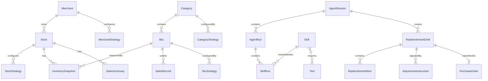

# 门店助手 Agent V1 本体模型文档

版本：V1.0  
适用范围：门店助手 Agent 第一版，覆盖经营日报/月报、智能补货建议、多轮微调、确认后一键生成采购单、多商家多门店策略配置。  
目标读者：产品经理、业务专家、AI Agent 开发、Java 后端开发、Node.js/TypeScript 开发、测试、运维、Codex / Claude Code / 其他 AI 编码助手。  
模型定位：本文件定义“门店助手 Agent”的领域本体，即对象、属性、关系、规则、约束、实例样例和 AI 执行边界，保证人和 AI 对业务语义理解一致。  

---

## 0. 文档使用约定

### 0.1 本体理论基础

本体模型采用以下思想组织：

1. **对象 / 类 Class**：业务领域中稳定存在的概念，例如商家、门店、SKU、库存、销售记录、补货草稿、采购单、Skill、策略。
2. **个体 Individual**：对象的具体实例，例如“商家 M001”“门店 S001”“矿泉水 550ml SKU001”。
3. **属性 Property**：对象自身的数据特征，例如 `storeName`、`currentStockQty`、`suggestQty`。
4. **关系 Relation / Object Property**：对象之间的连接，例如“门店属于商家”“SKU 属于品类”“补货草稿包含补货明细”。
5. **规则 Rule**：基于属性和关系进行判断、计算、约束和触发的业务语义。
6. **约束 Constraint**：必须满足的强规则，例如采购单创建前必须确认、采购明细数量必须为非负整数。

设计参考：OWL 2 将本体描述为 classes、properties、individuals 和 data values；RDFS 用 domain/range 描述属性适用对象和值域；SHACL 用 shapes 验证 RDF/图数据是否符合条件。本系统不强制第一版落 OWL/RDF 存储，但语义设计遵循这些思想，便于后续扩展为知识图谱或规则推理。

### 0.2 命名规范

| 类型 | 命名风格 | 示例 |
|---|---|---|
| 类 / 对象 | PascalCase | Merchant、Store、Sku、ReplenishmentDraft |
| 数据属性 | camelCase | merchantId、storeName、suggestQty |
| 关系属性 | camelCase，动词或介词短语 | belongsToMerchant、containsDraftItem |
| 枚举值 | UPPER_SNAKE_CASE | DRAFT、SUBMITTED、REPLENISHMENT_PLAN |
| Skill Code | lower_snake_case | replenishment_forecast |
| 策略 Code | lower_snake_case | convenience_store_replenishment_v1 |
| MCP Tool | lowerCamelCase | queryReplenishmentBaseData |

### 0.3 AI 执行原则

AI 在任何任务中必须遵守：

1. **不能编造数据**：销售额、库存、SKU、采购数量必须来自 MCP Tool 返回或已保存草稿。
2. **不能绕过确认**：创建采购单必须先展示结构化采购明细，并获得用户明确确认。
3. **不能从 Markdown 提单**：Markdown 是展示层，采购单明细必须来自 `ReplenishmentDraft.draftItems`。
4. **不能修改核心策略语义**：用户临时调整只影响当前草稿或当前会话，除非明确进入策略配置流程。
5. **不能跨商家/门店污染状态**：所有会话、草稿、策略和日志必须绑定 `merchantId`、`storeId`、`sessionId`。
6. **不能让 Skill 越权调用工具**：Skill 只能调用其 `requiredTools` 白名单内的 MCP Tool。

---

## 1. 领域边界

### 1.1 系统核心目标

门店助手 Agent V1 要解决的问题：

1. 对多商家、多门店的经营数据进行统一语义建模。
2. 通过 Skill 和策略实现差异化经营分析、补货建议和采购闭环。
3. 保证新增商家、门店、Skill 时不影响 Agent Core 主流程。
4. 保证 AI 和开发人员对对象、属性、关系、规则理解一致。

### 1.2 V1 业务边界

V1 覆盖：

| 模块 | 覆盖内容 |
|---|---|
| 经营报表 | 日报、月报、销售额、订单数、客单价、品类占比、商品排行、库存预警、AI 洞察 |
| 智能补货 | 未来 N 天补货建议、库存、近 7/14/30 天销量、在途、安全库存、节假日/活动修正 |
| 多轮微调 | 用户通过自然语言调整草稿，如“矿泉水上调 20%” |
| 采购闭环 | 从确认后的补货草稿创建 ERP 采购单 |
| 多策略 | 商家策略、门店策略、品类策略、SKU 策略、用户临时调整 |
| Skill 管理 | Skill 标准定义、输入输出 Schema、工具白名单、版本、风险等级 |

V1 不覆盖：

| 不覆盖项 | 原因 |
|---|---|
| 自动无确认下单 | 风险高，必须确认 |
| 多级审批流 | V1 先不做，可后续接 LangGraph Executor |
| 跨门店自动调拨 | 规则复杂，后续扩展 |
| 供应商智能谈判 | 超出 V1 范围 |
| 完整知识图谱存储 | V1 用关系表 + JSON 策略表达即可 |

---

## 2. 顶层本体结构

### 2.1 本体分层

```text
DomainOntology 门店助手领域本体
├── OrganizationOntology 组织域
│   ├── Merchant 商家
│   ├── Store 门店
│   └── User 用户
├── ProductOntology 商品域
│   ├── Category 品类
│   ├── Sku 商品/SKU
│   └── Supplier 供应商
├── OperationOntology 经营域
│   ├── SalesSummary 销售汇总
│   ├── SalesRecord 销售记录
│   ├── OrderSummary 订单汇总
│   └── InventorySnapshot 库存快照
├── ReplenishmentOntology 补货域
│   ├── ReplenishmentDraft 补货草稿
│   ├── ReplenishmentItem 补货明细
│   ├── AdjustmentInstruction 调整指令
│   └── PurchaseOrder 采购单
├── StrategyOntology 策略域
│   ├── StrategyTemplate 策略模板
│   ├── MerchantStrategy 商家策略
│   ├── StoreStrategy 门店策略
│   ├── CategoryStrategy 品类策略
│   ├── SkuStrategy SKU 策略
│   └── EffectiveStrategy 生效策略
├── AgentOntology Agent 域
│   ├── AgentSession 会话
│   ├── Intent 意图
│   ├── Skill Skill 能力
│   ├── SkillRun Skill 执行
│   ├── Tool MCP 工具
│   └── AgentRun Agent 执行
└── RenderOntology 展示域
    ├── ReportView 报表视图
    ├── Card 卡片
    ├── Chart 图表
    └── MarkdownReport Markdown 报告
```

### 2.2 核心关系图



---

## 3. 对象定义

## 3.1 组织域对象

### 3.1.1 Merchant 商家

**定义**：使用系统的业务主体，一个商家可以拥有多个门店。  
**唯一标识**：`merchantId`  
**业务说明**：商家是策略、Skill 启用、数据隔离、报表配置的一级边界。

| 属性 | 类型 | 必填 | 说明 | 示例 |
|---|---|---:|---|---|
| merchantId | string | 是 | 商家唯一标识 | M001 |
| merchantName | string | 是 | 商家名称 | XX 便利连锁 |
| businessType | enum | 是 | 业态 | CONVENIENCE_STORE |
| status | enum | 是 | 状态 | ENABLED |
| defaultStrategyTemplateCode | string | 否 | 默认策略模板 | convenience_store_replenishment_v1 |
| createdAt | datetime | 是 | 创建时间 | 2026-05-05 10:00:00 |
| updatedAt | datetime | 是 | 更新时间 | 2026-05-05 10:00:00 |

枚举：`businessType`

| 值 | 含义 |
|---|---|
| CONVENIENCE_STORE | 便利店 |
| APPAREL_STORE | 服装店 |
| HOME_TEXTILE_STORE | 家纺门店 |
| ELDER_SHOE_STORE | 老年鞋门店 |
| WHOLESALE | 批发商 |
| OTHER | 其他 |

关系：

| 关系 | 目标对象 | 基数 | 说明 |
|---|---|---|---|
| ownsStore | Store | 1:N | 商家拥有门店 |
| hasMerchantStrategy | MerchantStrategy | 1:N | 商家可配置多个版本策略 |
| enablesSkill | Skill | M:N | 商家可启用多个 Skill |

---

### 3.1.2 Store 门店

**定义**：商家下的具体经营单元。  
**唯一标识**：`storeId`  
**业务说明**：补货、日报、库存、销售都以门店为主要执行范围。

| 属性 | 类型 | 必填 | 说明 | 示例 |
|---|---|---:|---|---|
| storeId | string | 是 | 门店唯一标识 | S001 |
| merchantId | string | 是 | 所属商家 | M001 |
| storeName | string | 是 | 门店名称 | 解放路店 |
| storeType | enum | 是 | 门店类型 | COMMUNITY_STORE |
| regionCode | string | 否 | 区域编码 | CN-TJ-HX |
| status | enum | 是 | 状态 | ENABLED |
| timezone | string | 否 | 时区 | Asia/Shanghai |

枚举：`storeType`

| 值 | 含义 |
|---|---|
| COMMUNITY_STORE | 社区店 |
| MALL_STORE | 商场店 |
| CAMPUS_STORE | 校园店 |
| OFFICE_STORE | 写字楼店 |
| WAREHOUSE_STORE | 仓储店 |
| ONLINE_STORE | 线上店 |
| OTHER | 其他 |

关系：

| 关系 | 目标对象 | 基数 | 说明 |
|---|---|---|---|
| belongsToMerchant | Merchant | N:1 | 门店属于商家 |
| hasStoreStrategy | StoreStrategy | 1:N | 门店策略 |
| hasInventorySnapshot | InventorySnapshot | 1:N | 门店库存快照 |
| hasSalesSummary | SalesSummary | 1:N | 门店销售汇总 |

---

### 3.1.3 User 用户

**定义**：使用门店助手的人员。  
**唯一标识**：`userId`

| 属性 | 类型 | 必填 | 说明 | 示例 |
|---|---|---:|---|---|
| userId | string | 是 | 用户唯一标识 | U001 |
| merchantId | string | 是 | 所属商家 | M001 |
| storeId | string | 否 | 默认门店 | S001 |
| userName | string | 是 | 用户名称 | 张店长 |
| roleCode | enum | 是 | 角色编码 | STORE_MANAGER |
| status | enum | 是 | 状态 | ENABLED |

枚举：`roleCode`

| 值 | 含义 |
|---|---|
| STORE_MANAGER | 店长 |
| MERCHANT_OWNER | 商家老板 |
| OPERATOR | 运营人员 |
| ADMIN | 管理员 |

---

## 3.2 商品域对象

### 3.2.1 Category 品类

**定义**：SKU 的业务分类。  
**唯一标识**：`categoryCode`

| 属性 | 类型 | 必填 | 说明 | 示例 |
|---|---|---:|---|---|
| categoryCode | string | 是 | 品类编码 | beverage |
| categoryName | string | 是 | 品类名称 | 饮料 |
| parentCategoryCode | string | 否 | 父级品类 | food |
| merchantId | string | 是 | 所属商家 | M001 |
| status | enum | 是 | 状态 | ENABLED |

关系：

| 关系 | 目标对象 | 基数 | 说明 |
|---|---|---|---|
| containsSku | Sku | 1:N | 品类包含 SKU |
| hasCategoryStrategy | CategoryStrategy | 1:N | 品类可配置策略 |

---

### 3.2.2 Sku 商品/SKU

**定义**：可销售、可补货、可库存管理的最小商品单元。  
**唯一标识**：`skuId`

| 属性 | 类型 | 必填 | 说明 | 示例 |
|---|---|---:|---|---|
| skuId | string | 是 | SKU 唯一标识 | SKU001 |
| merchantId | string | 是 | 所属商家 | M001 |
| categoryCode | string | 是 | 所属品类 | beverage |
| skuName | string | 是 | SKU 名称 | 矿泉水 550ml |
| barcode | string | 否 | 条码 | 690000000001 |
| unit | string | 是 | 单位 | 瓶 |
| specification | string | 否 | 规格 | 550ml |
| status | enum | 是 | 状态 | ENABLED |
| replenishmentEnabled | boolean | 是 | 是否允许补货 | true |

关系：

| 关系 | 目标对象 | 基数 | 说明 |
|---|---|---|---|
| belongsToCategory | Category | N:1 | SKU 属于品类 |
| suppliedBy | Supplier | M:N | SKU 可由供应商供货 |
| hasSkuStrategy | SkuStrategy | 1:N | SKU 可配置策略 |
| appearsInInventory | InventorySnapshot | 1:N | SKU 出现在库存快照中 |
| appearsInSales | SalesRecord | 1:N | SKU 出现在销售记录中 |

---

### 3.2.3 Supplier 供应商

**定义**：采购单的供货主体。  
**唯一标识**：`supplierId`

| 属性 | 类型 | 必填 | 说明 | 示例 |
|---|---|---:|---|---|
| supplierId | string | 是 | 供应商唯一标识 | SUP001 |
| merchantId | string | 是 | 所属商家 | M001 |
| supplierName | string | 是 | 供应商名称 | XX 饮品供应商 |
| status | enum | 是 | 状态 | ENABLED |
| minOrderAmount | decimal | 否 | 最小起订金额 | 500.00 |

---

## 3.3 经营域对象

### 3.3.1 SalesSummary 销售汇总

**定义**：某门店在某时间范围内的销售聚合数据。  
**唯一标识**：`summaryId`

| 属性 | 类型 | 必填 | 说明 | 示例 |
|---|---|---:|---|---|
| summaryId | string | 是 | 汇总 ID | SS20260505001 |
| merchantId | string | 是 | 商家 ID | M001 |
| storeId | string | 是 | 门店 ID | S001 |
| startDate | date | 是 | 开始日期 | 2026-05-05 |
| endDate | date | 是 | 结束日期 | 2026-05-05 |
| salesAmount | decimal | 是 | 销售额 | 128000.00 |
| orderCount | integer | 是 | 订单数 | 356 |
| customerCount | integer | 否 | 客流/客户数 | 290 |
| avgOrderAmount | decimal | 否 | 客单价 | 359.55 |
| refundAmount | decimal | 否 | 退款金额 | 1200.00 |
| grossProfitAmount | decimal | 否 | 毛利额 | 32000.00 |

约束：

1. `endDate >= startDate`。
2. `salesAmount >= 0`。
3. `orderCount >= 0`。
4. `avgOrderAmount = salesAmount / orderCount`，当 `orderCount > 0` 时成立。

---

### 3.3.2 SalesRecord 销售记录

**定义**：SKU 粒度的销售记录或销售聚合明细。  
**唯一标识**：`salesRecordId`

| 属性 | 类型 | 必填 | 说明 | 示例 |
|---|---|---:|---|---|
| salesRecordId | string | 是 | 销售记录 ID | SR001 |
| merchantId | string | 是 | 商家 ID | M001 |
| storeId | string | 是 | 门店 ID | S001 |
| skuId | string | 是 | SKU ID | SKU001 |
| salesDate | date | 是 | 销售日期 | 2026-05-05 |
| salesQty | integer | 是 | 销售数量 | 42 |
| salesAmount | decimal | 是 | 销售金额 | 126.00 |
| grossProfitAmount | decimal | 否 | 毛利额 | 36.00 |

约束：

1. `salesQty >= 0`。
2. `salesAmount >= 0`。

---

### 3.3.3 InventorySnapshot 库存快照

**定义**：门店在某时间点的 SKU 库存状态。  
**唯一标识**：`snapshotId`

| 属性 | 类型 | 必填 | 说明 | 示例 |
|---|---|---:|---|---|
| snapshotId | string | 是 | 快照 ID | INV001 |
| merchantId | string | 是 | 商家 ID | M001 |
| storeId | string | 是 | 门店 ID | S001 |
| skuId | string | 是 | SKU ID | SKU001 |
| snapshotTime | datetime | 是 | 快照时间 | 2026-05-05 09:00:00 |
| currentStockQty | integer | 是 | 当前库存 | 65 |
| availableStockQty | integer | 否 | 可用库存 | 60 |
| lockedStockQty | integer | 否 | 锁定库存 | 5 |
| inTransitQty | integer | 否 | 在途数量 | 20 |

约束：

1. `currentStockQty >= 0`。
2. `availableStockQty >= 0`。
3. `lockedStockQty >= 0`。
4. `inTransitQty >= 0`。
5. `currentStockQty >= availableStockQty`。

---

## 3.4 补货域对象

### 3.4.1 ReplenishmentDraft 补货草稿

**定义**：Agent 基于数据、策略和用户指令生成的待确认补货方案。  
**唯一标识**：`draftId`  
**业务说明**：采购单创建的数据源，必须结构化保存。

| 属性 | 类型 | 必填 | 说明 | 示例 |
|---|---|---:|---|---|
| draftId | string | 是 | 草稿 ID | DRAFT001 |
| sessionId | string | 是 | 会话 ID | SESSION001 |
| merchantId | string | 是 | 商家 ID | M001 |
| storeId | string | 是 | 门店 ID | S001 |
| status | enum | 是 | 草稿状态 | DRAFT |
| forecastDays | integer | 是 | 预测天数 | 7 |
| effectiveStrategyVersion | string | 是 | 生效策略版本 | ES-V1 |
| conditionsJson | JSON | 否 | 条件和用户调整 | {} |
| reportMarkdown | text | 否 | 展示报告 | # 补货建议 |
| createdBy | string | 是 | 创建用户 | U001 |
| createdAt | datetime | 是 | 创建时间 | 2026-05-05 10:00:00 |
| updatedAt | datetime | 是 | 更新时间 | 2026-05-05 10:10:00 |

枚举：`status`

| 值 | 含义 | 是否可提单 |
|---|---|---:|
| DRAFT | 草稿 | 否 |
| WAIT_CONFIRM | 等待确认 | 否 |
| CONFIRMED | 已确认 | 是 |
| SUBMITTED | 已生成采购单 | 否 |
| CANCELLED | 已取消 | 否 |
| FAILED | 提单失败 | 否 |

关系：

| 关系 | 目标对象 | 基数 | 说明 |
|---|---|---|---|
| containsDraftItem | ReplenishmentItem | 1:N | 草稿包含补货明细 |
| adjustedBy | AdjustmentInstruction | 1:N | 草稿被多轮指令调整 |
| submittedAs | PurchaseOrder | 0:1 | 草稿最终生成采购单 |

强规则：

1. `SUBMITTED` 状态的草稿不能再次提交。
2. 创建采购单时，必须使用 `ReplenishmentDraft.containsDraftItem` 中的结构化数据。
3. 同一 `sessionId` 可以有多个草稿，但只有最新 `DRAFT / WAIT_CONFIRM / CONFIRMED` 草稿可被当前对话继续调整。

---

### 3.4.2 ReplenishmentItem 补货明细

**定义**：补货草稿中的 SKU 级建议明细。  
**唯一标识**：`draftItemId`

| 属性 | 类型 | 必填 | 说明 | 示例 |
|---|---|---:|---|---|
| draftItemId | string | 是 | 明细 ID | DI001 |
| draftId | string | 是 | 草稿 ID | DRAFT001 |
| skuId | string | 是 | SKU ID | SKU001 |
| skuName | string | 是 | SKU 名称 | 矿泉水 550ml |
| categoryCode | string | 是 | 品类编码 | beverage |
| currentStockQty | integer | 是 | 当前库存 | 65 |
| inTransitQty | integer | 否 | 在途数量 | 20 |
| salesAvg7d | decimal | 否 | 近 7 日日均销量 | 42 |
| salesAvg14d | decimal | 否 | 近 14 日日均销量 | 38 |
| salesAvg30d | decimal | 否 | 近 30 日日均销量 | 35 |
| safetyStockDays | decimal | 是 | 安全库存天数 | 2 |
| baseSuggestQty | integer | 是 | 基础建议量 | 120 |
| finalSuggestQty | integer | 是 | 最终建议量 | 144 |
| unit | string | 是 | 单位 | 瓶 |
| riskLevel | enum | 是 | 风险等级 | HIGH |
| reason | string | 是 | 建议原因 | 活动上调 20% |

枚举：`riskLevel`

| 值 | 含义 |
|---|---|
| LOW | 低风险 |
| MEDIUM | 中风险 |
| HIGH | 高风险 |

约束：

1. `finalSuggestQty >= 0`。
2. `finalSuggestQty` 必须为整数。
3. 若 SKU 不允许补货，则不得出现在最终提单明细中。
4. 若存在 `minOrderQty` 或 `orderMultiple`，最终建议量需满足对应规则或明确说明无法满足。

---

### 3.4.3 AdjustmentInstruction 调整指令

**定义**：用户对补货草稿进行多轮微调时，Agent 从自然语言中抽取的结构化调整条件。  
**唯一标识**：`adjustmentId`

| 属性 | 类型 | 必填 | 说明 | 示例 |
|---|---|---:|---|---|
| adjustmentId | string | 是 | 调整 ID | ADJ001 |
| draftId | string | 是 | 草稿 ID | DRAFT001 |
| userMessage | text | 是 | 用户原始输入 | 明天隔壁有活动，把矿泉水调高 20% |
| targetType | enum | 是 | 调整目标类型 | SKU_KEYWORD |
| targetValue | string | 是 | 调整目标值 | 矿泉水 |
| adjustmentType | enum | 是 | 调整类型 | INCREASE_RATE |
| adjustmentRate | decimal | 否 | 调整比例 | 0.2 |
| adjustmentQty | integer | 否 | 调整数量 | 24 |
| effectiveDate | date | 否 | 生效日期 | 2026-05-06 |
| reason | string | 是 | 调整原因 | 隔壁有活动 |
| createdAt | datetime | 是 | 创建时间 | 2026-05-05 10:20:00 |

枚举：`targetType`

| 值 | 含义 |
|---|---|
| SKU_ID | 指定 SKU ID |
| SKU_KEYWORD | SKU 名称关键词 |
| CATEGORY_CODE | 指定品类 |
| ALL | 全部明细 |

枚举：`adjustmentType`

| 值 | 含义 |
|---|---|
| INCREASE_RATE | 按比例上调 |
| DECREASE_RATE | 按比例下调 |
| INCREASE_QTY | 按数量上调 |
| DECREASE_QTY | 按数量下调 |
| SET_QTY | 设置为指定数量 |
| EXCLUDE | 排除该商品 |

强规则：

1. 调整指令必须先结构化，再更新草稿。
2. 若目标匹配多个 SKU，Agent 必须明确列出影响范围。
3. 若目标无法匹配 SKU，不能修改草稿，必须提示用户确认目标。

---

### 3.4.4 PurchaseOrder 采购单

**定义**：由确认后的补货草稿创建的 ERP 采购单。  
**唯一标识**：`purchaseOrderNo`

| 属性 | 类型 | 必填 | 说明 | 示例 |
|---|---|---:|---|---|
| purchaseOrderNo | string | 是 | 采购单号 | PO202605050001 |
| merchantId | string | 是 | 商家 ID | M001 |
| storeId | string | 是 | 门店 ID | S001 |
| sourceDraftId | string | 是 | 来源草稿 | DRAFT001 |
| source | enum | 是 | 来源 | AI_REPLENISHMENT_AGENT |
| status | enum | 是 | 单据状态 | CREATED |
| createdBy | string | 是 | 创建用户 | U001 |
| createdAt | datetime | 是 | 创建时间 | 2026-05-05 10:30:00 |

强规则：

1. `sourceDraftId` 必须存在且状态为 `CONFIRMED`。
2. 一个 `sourceDraftId` 最多只能成功创建一个采购单。
3. 创建成功后，草稿状态必须更新为 `SUBMITTED`。

---

## 3.5 策略域对象

### 3.5.1 StrategyTemplate 策略模板

**定义**：某类业态的默认策略集合。  
**唯一标识**：`templateCode`

| 属性 | 类型 | 必填 | 说明 | 示例 |
|---|---|---:|---|---|
| templateCode | string | 是 | 模板编码 | convenience_store_replenishment_v1 |
| templateName | string | 是 | 模板名称 | 便利店补货模板 V1 |
| businessType | enum | 是 | 适用业态 | CONVENIENCE_STORE |
| strategyJson | JSON | 是 | 策略内容 | {} |
| version | string | 是 | 版本 | 1.0.0 |
| status | enum | 是 | 状态 | ENABLED |

---

### 3.5.2 MerchantStrategy 商家策略

**定义**：商家级差异化策略。  
**唯一标识**：`merchantStrategyId`

| 属性 | 类型 | 必填 | 说明 | 示例 |
|---|---|---:|---|---|
| merchantStrategyId | string | 是 | 策略 ID | MS001 |
| merchantId | string | 是 | 商家 ID | M001 |
| baseTemplateCode | string | 是 | 继承模板 | convenience_store_replenishment_v1 |
| enabledSkills | array | 是 | 启用 Skill | ["business_daily_report"] |
| strategyJson | JSON | 是 | 商家策略覆盖项 | {} |
| version | string | 是 | 策略版本 | 1.0.0 |
| status | enum | 是 | 状态 | ENABLED |

---

### 3.5.3 StoreStrategy 门店策略

**定义**：门店级差异化策略。  
**唯一标识**：`storeStrategyId`

| 属性 | 类型 | 必填 | 说明 | 示例 |
|---|---|---:|---|---|
| storeStrategyId | string | 是 | 策略 ID | SS001 |
| merchantId | string | 是 | 商家 ID | M001 |
| storeId | string | 是 | 门店 ID | S001 |
| enabledSkills | array | 否 | 门店启用 Skill 覆盖 | [] |
| strategyJson | JSON | 是 | 门店策略覆盖项 | {} |
| version | string | 是 | 策略版本 | 1.0.0 |
| status | enum | 是 | 状态 | ENABLED |

---

### 3.5.4 CategoryStrategy 品类策略

**定义**：针对品类的补货、报表和风险策略。  
**唯一标识**：`categoryStrategyId`

| 属性 | 类型 | 必填 | 说明 | 示例 |
|---|---|---:|---|---|
| categoryStrategyId | string | 是 | 策略 ID | CS001 |
| merchantId | string | 是 | 商家 ID | M001 |
| storeId | string | 否 | 门店 ID，空表示商家全局 | S001 |
| categoryCode | string | 是 | 品类编码 | beverage |
| strategyJson | JSON | 是 | 策略内容 | {} |
| version | string | 是 | 版本 | 1.0.0 |
| status | enum | 是 | 状态 | ENABLED |

---

### 3.5.5 SkuStrategy SKU 策略

**定义**：SKU 级精细策略。  
**唯一标识**：`skuStrategyId`

| 属性 | 类型 | 必填 | 说明 | 示例 |
|---|---|---:|---|---|
| skuStrategyId | string | 是 | 策略 ID | SKS001 |
| merchantId | string | 是 | 商家 ID | M001 |
| storeId | string | 否 | 门店 ID | S001 |
| skuId | string | 是 | SKU ID | SKU001 |
| strategyJson | JSON | 是 | SKU 策略内容 | {} |
| version | string | 是 | 版本 | 1.0.0 |
| status | enum | 是 | 状态 | ENABLED |

---

### 3.5.6 EffectiveStrategy 生效策略

**定义**：经过模板、商家、门店、品类、SKU、用户临时调整合并后的运行时策略。  
**说明**：不一定需要持久化，建议在每次 AgentRun 中生成并记录摘要。

| 属性 | 类型 | 必填 | 说明 |
|---|---|---:|---|
| effectiveStrategyId | string | 是 | 生效策略 ID |
| merchantId | string | 是 | 商家 ID |
| storeId | string | 是 | 门店 ID |
| strategyVersionChain | array | 是 | 参与合并的策略版本链 |
| effectiveJson | JSON | 是 | 合并后的策略 |
| generatedAt | datetime | 是 | 生成时间 |

策略优先级：

```text
用户本轮明确指令
  > SKU 策略
  > 品类策略
  > 门店策略
  > 商家策略
  > 策略模板
  > 平台默认策略
```

---

## 3.6 Agent 域对象

### 3.6.1 AgentSession 会话

**定义**：用户与门店助手的一段连续对话上下文。  
**唯一标识**：`sessionId`

| 属性 | 类型 | 必填 | 说明 | 示例 |
|---|---|---:|---|---|
| sessionId | string | 是 | 会话 ID | SESSION001 |
| merchantId | string | 是 | 商家 ID | M001 |
| storeId | string | 否 | 当前门店 ID | S001 |
| userId | string | 是 | 用户 ID | U001 |
| lastIntent | enum | 否 | 最近意图 | REPLENISHMENT_PLAN |
| activeDraftId | string | 否 | 当前活跃草稿 | DRAFT001 |
| status | enum | 是 | 会话状态 | ACTIVE |
| createdAt | datetime | 是 | 创建时间 | 2026-05-05 10:00:00 |
| updatedAt | datetime | 是 | 更新时间 | 2026-05-05 10:20:00 |

---

### 3.6.2 Intent 意图

**定义**：用户消息的业务意图分类。

| 意图编码 | 含义 | 典型输入 |
|---|---|---|
| BUSINESS_DAILY_REPORT | 经营日报 | 生成今天的经营日报 |
| BUSINESS_MONTHLY_REPORT | 经营月报 | 生成本月经营月报 |
| REPLENISHMENT_PLAN | 生成补货建议 | 生成未来 7 天补货建议 |
| ADJUST_REPLENISHMENT_DRAFT | 调整补货草稿 | 矿泉水上调 20% |
| CONFIRM_CREATE_PURCHASE_ORDER | 确认创建采购单 | 确认生成采购单 |
| GENERAL_QA | 普通问答 | 这个指标是什么意思 |
| UNKNOWN | 未识别 | 无法判断 |

约束：

1. `CONFIRM_CREATE_PURCHASE_ORDER` 必须存在可确认草稿。
2. `ADJUST_REPLENISHMENT_DRAFT` 必须存在活跃草稿。
3. `UNKNOWN` 不得调用写入类 MCP Tool。

---

### 3.6.3 SkillDef 注册项 / Skill 能力

**定义**：`agent_skill_def` 中用于注册、灰度、回滚和工具白名单校验的运行时条目；多数条目对应可被 Agent 编排的业务能力组件，少数条目对应固定 workflow。V1 中 `purchase_order_create` 是高风险 HITL 确认工作流，保留 `skillCode` 只是为了复用 SkillDef 守门机制。
**唯一标识**：`skillCode + version`

| 属性 | 类型 | 必填 | 说明 | 示例 |
|---|---|---:|---|---|
| skillCode | string | 是 | Skill 编码 | replenishment_forecast |
| skillName | string | 是 | Skill 名称 | 智能补货预测 |
| version | string | 是 | 版本 | 1.0.0 |
| description | string | 是 | 能力说明 | 根据库存和销量生成补货建议 |
| allowedIntents | array | 是 | 允许处理的意图 | [REPLENISHMENT_PLAN] |
| inputSchemaJson | JSON | 是 | 输入 Schema | {} |
| outputSchemaJson | JSON | 是 | 输出 Schema | {} |
| requiredTools | array | 是 | 需要的 MCP Tool | [queryReplenishmentBaseData] |
| riskLevel | enum | 是 | 风险等级 | MEDIUM |
| status | enum | 是 | 状态 | ENABLED |

强规则：

1. 每个 SkillDef 注册项必须定义输入输出 Schema。
2. 每个 SkillDef 注册项必须声明工具白名单。
3. 新增业务能力或 workflow 不允许修改 Agent Core 主流程。
4. 高风险 HITL workflow 必须经过 Confirm Manager。

---

### 3.6.4 Tool MCP 工具

**定义**：ERP MCP Server 暴露给 Agent 的查询或执行能力。

| 属性 | 类型 | 必填 | 说明 | 示例 |
|---|---|---:|---|---|
| toolName | string | 是 | 工具名称 | queryReplenishmentBaseData |
| toolType | enum | 是 | 工具类型 | QUERY |
| description | string | 是 | 工具说明 | 查询补货基础数据 |
| inputSchemaJson | JSON | 是 | 输入 Schema | {} |
| outputSchemaJson | JSON | 是 | 输出 Schema | {} |
| riskLevel | enum | 是 | 风险等级 | LOW |
| timeoutMs | integer | 是 | 超时时间 | 5000 |
| status | enum | 是 | 状态 | ENABLED |

枚举：`toolType`

| 值 | 含义 |
|---|---|
| QUERY | 查询工具 |
| WRITE | 写入工具 |
| COMPUTE | 计算工具 |

强规则：

1. `WRITE` 类型工具必须经过 Confirm Manager。
2. MCP Tool 不做大模型推理。
3. MCP Tool 返回必须结构化。

---

### 3.6.5 AgentRun / SkillRun 执行记录

**AgentRun 定义**：一次用户请求的完整执行链路。  
**SkillRun 定义**：一次 Skill 的具体执行记录。

AgentRun 核心属性：

| 属性 | 类型 | 必填 | 说明 |
|---|---|---:|---|
| traceId | string | 是 | 链路 ID |
| sessionId | string | 是 | 会话 ID |
| merchantId | string | 是 | 商家 ID |
| storeId | string | 否 | 门店 ID |
| userMessage | text | 是 | 用户输入 |
| detectedIntent | enum | 是 | 识别意图 |
| selectedSkills | array | 是 | 选择的 Skill |
| usedTools | array | 否 | 调用的 MCP Tool |
| success | boolean | 是 | 是否成功 |
| elapsedMs | integer | 是 | 耗时 |
| errorMessage | text | 否 | 错误信息 |

SkillRun 核心属性：

| 属性 | 类型 | 必填 | 说明 |
|---|---|---:|---|
| skillRunId | string | 是 | Skill 执行 ID |
| traceId | string | 是 | 链路 ID |
| skillCode | string | 是 | Skill 编码 |
| skillVersion | string | 是 | Skill 版本 |
| inputJson | JSON | 是 | 输入 |
| outputJson | JSON | 否 | 输出 |
| usedToolsJson | JSON | 否 | 工具调用 |
| success | boolean | 是 | 是否成功 |
| elapsedMs | integer | 是 | 耗时 |

---

## 4. 数据属性总表

### 4.1 通用属性

| 属性 | Domain | Range | 说明 |
|---|---|---|---|
| merchantId | Merchant / Store / Sku / AgentSession / Draft | string | 商家 ID |
| storeId | Store / SalesSummary / Inventory / Draft | string | 门店 ID |
| skuId | Sku / SalesRecord / Inventory / DraftItem | string | SKU ID |
| sessionId | AgentSession / AgentRun / Draft | string | 会话 ID |
| traceId | AgentRun / SkillRun | string | 链路追踪 ID |
| status | 多对象 | enum | 状态 |
| createdAt | 多对象 | datetime | 创建时间 |
| updatedAt | 多对象 | datetime | 更新时间 |

### 4.2 补货相关属性

| 属性 | Domain | Range | 说明 |
|---|---|---|---|
| forecastDays | ReplenishmentDraft | integer | 预测天数 |
| currentStockQty | ReplenishmentItem / InventorySnapshot | integer | 当前库存 |
| inTransitQty | ReplenishmentItem / InventorySnapshot | integer | 在途数量 |
| salesAvg7d | ReplenishmentItem | decimal | 近 7 日日均销量 |
| safetyStockDays | ReplenishmentItem / Strategy | decimal | 安全库存天数 |
| baseSuggestQty | ReplenishmentItem | integer | 基础建议量 |
| finalSuggestQty | ReplenishmentItem | integer | 最终建议量 |
| reason | ReplenishmentItem / AdjustmentInstruction | string | 原因说明 |

### 4.3 策略相关属性

| 属性 | Domain | Range | 说明 |
|---|---|---|---|
| enabledSkills | MerchantStrategy / StoreStrategy | array | 启用 Skill |
| strategyJson | StrategyTemplate / MerchantStrategy / StoreStrategy | JSON | 策略内容 |
| version | Skill / Strategy | string | 版本 |
| riskLevel | Skill / Tool | enum | 风险等级 |
| requiredTools | Skill | array | 所需工具 |

---

## 5. 对象关系总表

| 关系 | Domain | Range | 基数 | 说明 |
|---|---|---|---|---|
| ownsStore | Merchant | Store | 1:N | 商家拥有门店 |
| belongsToMerchant | Store | Merchant | N:1 | 门店属于商家 |
| containsSku | Category | Sku | 1:N | 品类包含 SKU |
| belongsToCategory | Sku | Category | N:1 | SKU 属于品类 |
| hasInventorySnapshot | Store | InventorySnapshot | 1:N | 门店有库存快照 |
| hasSalesSummary | Store | SalesSummary | 1:N | 门店有销售汇总 |
| createsDraft | AgentSession | ReplenishmentDraft | 1:N | 会话创建草稿 |
| containsDraftItem | ReplenishmentDraft | ReplenishmentItem | 1:N | 草稿包含明细 |
| adjustedBy | ReplenishmentDraft | AdjustmentInstruction | 1:N | 草稿被调整 |
| submittedAs | ReplenishmentDraft | PurchaseOrder | 0:1 | 草稿提交为采购单 |
| enablesSkill | MerchantStrategy / StoreStrategy | Skill | M:N | 策略启用 Skill |
| requiresTool | Skill | Tool | M:N | Skill 需要工具 |
| executesSkill | AgentRun | SkillRun | 1:N | AgentRun 包含 SkillRun |

---

## 6. 规则体系

## 6.1 策略合并规则

### R-STRATEGY-001 策略优先级规则

**规则**：当多个策略对同一属性给出不同值时，按以下优先级覆盖：

```text
用户本轮明确指令
  > SKU 策略
  > 品类策略
  > 门店策略
  > 商家策略
  > 策略模板
  > 平台默认策略
```

**示例**：

```text
平台默认 safetyStockDays = 2
商家策略 safetyStockDays = 3
饮料品类 safetyStockDays = 4
矿泉水 SKU safetyStockDays = 5
用户说“矿泉水明天活动上调 20%”

最终：矿泉水 safetyStockDays = 5，并叠加临时活动调整 +20%。
```

---

### R-STRATEGY-002 策略作用域规则

**规则**：策略必须绑定作用域，不能跨作用域生效。

| 策略类型 | 作用域 |
|---|---|
| MerchantStrategy | merchantId |
| StoreStrategy | merchantId + storeId |
| CategoryStrategy | merchantId + storeId? + categoryCode |
| SkuStrategy | merchantId + storeId? + skuId |
| 用户临时调整 | sessionId + draftId |

**AI 要求**：AI 在解释策略时必须说明策略来源，例如“该建议应用了门店策略和饮料品类策略”。

---

## 6.2 Skill 编排规则

### R-SKILL-001 Skill 可用性规则

Skill 可执行必须同时满足：

```text
Skill.status = ENABLED
Skill.allowedIntents 包含 detectedIntent
商家/门店 enabledSkills 包含 skillCode
Skill.requiredTools 全部可用
输入满足 inputSchema
```

若不满足，Agent Core 不得执行该 Skill。

---

### R-SKILL-002 Tool 白名单规则

Skill 只能调用其 `requiredTools` 声明的 MCP Tool。

**禁止**：

```text
replenishment_forecast 直接调用 createPurchaseOrder
business_daily_report 调用写入类工具
任何 Skill 调用未注册工具
```

---

### R-SKILL-003 输出校验规则

Skill 输出必须满足 `outputSchemaJson`。校验失败时：

```text
1. 不保存业务草稿
2. 不执行写操作
3. 记录 skill_run_log
4. 返回可理解错误提示
```

---

## 6.3 补货计算规则

### R-REP-001 基础补货量规则

推荐基础公式：

```text
预测需求量 = forecastDailyQty × forecastDays × demandFactor
安全库存量 = forecastDailyQty × safetyStockDays
理论补货量 = 预测需求量 + 安全库存量 - currentStockQty - inTransitQty
baseSuggestQty = max(理论补货量, 0)
```

其中：

| 参数 | 来源 |
|---|---|
| forecastDailyQty | MCP Tool 返回，或由近 7/14/30 日销量加权计算 |
| forecastDays | 策略或用户输入 |
| demandFactor | 策略、节假日、活动、天气等修正因子 |
| safetyStockDays | 生效策略 |
| currentStockQty | 库存快照 |
| inTransitQty | 在途数量 |

---

### R-REP-002 加权销量规则

默认加权公式：

```text
forecastDailyQty = salesAvg7d × 0.5 + salesAvg14d × 0.3 + salesAvg30d × 0.2
```

如果某个均值缺失：

```text
1. 优先使用已有更短周期均值。
2. 若全部缺失，不能生成该 SKU 的补货建议。
3. 必须在报告中标记“销售历史不足”。
```

---

### R-REP-003 活动修正规则

用户输入或策略中出现活动影响时，必须转为结构化调整：

```json
{
  "targetType": "SKU_KEYWORD",
  "targetValue": "矿泉水",
  "adjustmentType": "INCREASE_RATE",
  "adjustmentRate": 0.2,
  "reason": "明天隔壁有活动"
}
```

Agent 不得仅在 Markdown 中描述活动影响而不更新 `ReplenishmentItem.finalSuggestQty`。

---

### R-REP-004 起订量与倍数规则

若 SKU 策略存在：

```json
{
  "minOrderQty": 24,
  "orderMultiple": 12
}
```

则最终建议量需满足：

```text
finalSuggestQty = 0
或 finalSuggestQty >= minOrderQty 且 finalSuggestQty % orderMultiple = 0
```

如无法满足，必须给出原因并标记为 `riskLevel = MEDIUM/HIGH`。

---

## 6.4 多轮调整规则

### R-ADJ-001 活跃草稿规则

用户发起补货调整时，必须存在活跃草稿：

```text
AgentSession.activeDraftId 不为空
且 ReplenishmentDraft.status in [DRAFT, WAIT_CONFIRM]
```

否则 Agent 必须提示用户先生成补货建议。

---

### R-ADJ-002 目标匹配规则

调整目标匹配顺序：

```text
skuId 精确匹配
  > skuName 精确匹配
  > skuName 关键词匹配
  > categoryCode 匹配
```

若匹配多个 SKU，Agent 必须展示影响列表。  
若匹配 0 个 SKU，Agent 不得修改草稿。

---

### R-ADJ-003 调整留痕规则

每次调整必须保存：

```text
用户原文
结构化调整条件
调整前明细
调整后明细
调整原因
执行人
执行时间
```

---

## 6.5 采购单规则

### R-PO-001 确认规则

创建采购单前必须满足：

```text
1. 存在 ReplenishmentDraft
2. 草稿状态为 WAIT_CONFIRM 或 CONFIRMED
3. 用户明确表达确认，例如“确认生成采购单”“提交采购单”
4. draftItems 非空
5. 所有 finalSuggestQty >= 0
```

---

### R-PO-002 单草稿单采购单规则

一个 `draftId` 最多只能成功创建一个采购单。

若重复确认：

```text
若已有 purchaseOrderNo，返回已创建结果。
不得重复调用 createPurchaseOrder。
```

---

### R-PO-003 Markdown 禁用规则

采购单明细来源必须是：

```text
ReplenishmentDraft.containsDraftItem.finalSuggestQty
```

禁止来源：

```text
reportMarkdown 中重新解析出来的 SKU 和数量
模型临时生成的 SKU 和数量
```

---

## 6.6 数据隔离规则

### R-SEC-001 商家隔离规则

任何查询、草稿、策略、采购单必须绑定 `merchantId`。  
Agent 不得跨 `merchantId` 查询或引用数据。

### R-SEC-002 门店隔离规则

当请求绑定 `storeId` 时，Agent 只能使用该门店数据。  
如需跨门店分析，必须由用户明确指定，且 V1 默认不支持自动跨门店调拨。

---

## 7. Skill 标准定义

## 7.1 Skill 接口模型

```ts
export interface AgentSkill<Input, Output> {
  code: string;
  name: string;
  version: string;
  description: string;
  allowedIntents: string[];
  inputSchema: unknown;
  outputSchema: unknown;
  requiredTools: string[];
  riskLevel: 'LOW' | 'MEDIUM' | 'HIGH';
  execute(ctx: SkillContext, input: Input): Promise<Output>;
}
```

## 7.2 SkillContext

```ts
export interface SkillContext {
  traceId: string;
  sessionId: string;
  merchantId: string;
  storeId?: string;
  userId: string;
  detectedIntent: string;
  effectiveStrategy: Record<string, unknown>;
  toolCaller: ToolCaller;
  draftManager: DraftManager;
  logger: RunLogger;
}
```

## 7.3 V1 SkillDef / Workflow 清单

> 命名说明：`skillCode` 是运行时注册 ID，必须与 workflow id 对齐；它不总等同于产品语义上的“Skill”。`purchase_order_create` 是确认采购单的 HITL workflow。

| skillCode | 运行形态 | 意图 | 风险等级 | 说明 |
|---|---|---|---|---|
| business_daily_report | 经营日报 workflow / 业务能力 | BUSINESS_DAILY_REPORT | LOW | 生成日经营分析 |
| business_monthly_report | 经营月报 workflow / 业务能力 | BUSINESS_MONTHLY_REPORT | LOW | 生成月经营分析 |
| replenishment_forecast | 补货预测 workflow / 业务能力 | REPLENISHMENT_PLAN | MEDIUM | 生成补货草稿 |
| replenishment_adjustment | 补货调整 workflow / 指令处理能力 | ADJUST_REPLENISHMENT_DRAFT | MEDIUM | 多轮调整草稿 |
| purchase_order_create | HITL 确认采购单 workflow | CONFIRM_CREATE_PURCHASE_ORDER | HIGH | 确认后创建采购单；兼容 SkillDef 守门但不是普通 Skill |

---

## 8. MCP Tool 标准定义

## 8.1 Tool 清单

| Tool Name | 类型 | 风险 | 说明 |
|---|---|---|---|
| getStoreReportConfig | QUERY | LOW | 查询门店报表配置 |
| queryStoreSalesSummary | QUERY | LOW | 查询销售汇总 |
| queryCategorySalesRatio | QUERY | LOW | 查询品类占比 |
| queryProductSalesRank | QUERY | LOW | 查询商品排行 |
| queryInventoryOverview | QUERY | LOW | 查询库存概览 |
| queryReplenishmentBaseData | QUERY | LOW | 查询补货基础数据 |
| createPurchaseOrder | WRITE | HIGH | 创建 ERP 采购单 |

## 8.2 queryReplenishmentBaseData 输出标准

```json
{
  "merchantId": "M001",
  "storeId": "S001",
  "forecastDays": 7,
  "items": [
    {
      "skuId": "SKU001",
      "skuName": "矿泉水 550ml",
      "categoryCode": "beverage",
      "currentStockQty": 65,
      "inTransitQty": 20,
      "salesAvg7d": 42,
      "salesAvg14d": 38,
      "salesAvg30d": 35,
      "minOrderQty": 24,
      "orderMultiple": 12,
      "replenishmentEnabled": true
    }
  ],
  "contextFactors": [
    {
      "factorType": "HOLIDAY",
      "factorValue": 1.1,
      "reason": "节假日后客流恢复"
    }
  ]
}
```

## 8.3 createPurchaseOrder 输入标准

```json
{
  "merchantId": "M001",
  "storeId": "S001",
  "source": "AI_REPLENISHMENT_AGENT",
  "sourceDraftId": "DRAFT001",
  "items": [
    {
      "skuId": "SKU001",
      "quantity": 144,
      "unit": "瓶",
      "reason": "明天周边活动，预测需求上调20%"
    }
  ]
}
```

---

## 9. 策略模型

## 9.1 平台默认策略示例

```json
{
  "strategyLevel": "PLATFORM_DEFAULT",
  "replenishmentPolicy": {
    "forecastDays": 7,
    "forecastMethod": "weighted_moving_average",
    "defaultSafetyStockDays": 2,
    "allowAutoPurchaseOrder": false,
    "requireConfirmBeforePurchaseOrder": true
  },
  "reportPolicy": {
    "summaryStyle": "detail",
    "enabledMetrics": [
      "salesAmount",
      "orderCount",
      "avgOrderAmount",
      "categoryRatio",
      "topProducts",
      "inventoryWarning"
    ]
  }
}
```

## 9.2 商家策略示例

```json
{
  "merchantId": "M001",
  "businessType": "CONVENIENCE_STORE",
  "baseTemplateCode": "convenience_store_replenishment_v1",
  "enabledSkills": [
    "business_daily_report",
    "business_monthly_report",
    "replenishment_forecast",
    "replenishment_adjustment",
    "purchase_order_create"
  ],
  "strategy": {
    "replenishmentPolicy": {
      "forecastDays": 7,
      "defaultSafetyStockDays": 3,
      "allowAutoPurchaseOrder": false
    }
  }
}
```

## 9.3 门店策略示例

```json
{
  "storeId": "S001",
  "storeType": "COMMUNITY_STORE",
  "strategy": {
    "trafficPattern": "WEEKEND_HIGH",
    "replenishmentPolicy": {
      "forecastDays": 5
    },
    "specialRules": [
      {
        "ruleCode": "weekend_beverage_boost",
        "when": {
          "dayType": "WEEKEND"
        },
        "then": {
          "targetCategory": "beverage",
          "adjustmentRate": 0.15,
          "reason": "周末社区店饮料销量通常上升"
        }
      }
    ]
  }
}
```

## 9.4 SKU 策略示例

```json
{
  "skuId": "SKU001",
  "strategy": {
    "replenishmentEnabled": true,
    "minOrderQty": 24,
    "orderMultiple": 12,
    "maxStockQty": 300,
    "safetyStockDays": 5,
    "eventSensitive": true
  }
}
```

---

## 10. AI 任务语义说明

## 10.1 经营日报任务

用户输入：

```text
生成今天的经营日报
```

AI 必须执行：

```text
1. 识别意图 BUSINESS_DAILY_REPORT。
2. 加载 merchantId、storeId。
3. 加载报表策略。
4. 选择 business_daily_report Skill。
5. 调用销售、品类、商品排行、库存相关 MCP Tool。
6. 生成 Markdown 总结和结构化 report JSON。
7. 输出异常诊断，但不得编造未查询到的数据。
```

输出必须包含：

```text
reportType
summaryMarkdown
cards
charts
abnormalInsights
dataSourceSummary
```

---

## 10.2 补货建议任务

用户输入：

```text
生成未来 7 天补货建议
```

AI 必须执行：

```text
1. 识别意图 REPLENISHMENT_PLAN。
2. 加载策略，得到 forecastDays、safetyStockDays 等参数。
3. 选择 replenishment_forecast Skill。
4. 调用 queryReplenishmentBaseData。
5. 根据确定性公式计算 baseSuggestQty。
6. 应用策略修正和上下文因子。
7. 生成 ReplenishmentDraft 和 ReplenishmentItem。
8. 保存草稿。
9. 输出 Markdown 报告和结构化草稿摘要。
```

AI 不得：

```text
1. 直接调用 createPurchaseOrder。
2. 仅输出 Markdown 而不保存草稿。
3. 给没有库存和销量数据的 SKU 编造建议量。
```

---

## 10.3 多轮调整任务

用户输入：

```text
明天隔壁有活动，把矿泉水预测量调高 20%
```

AI 必须执行：

```text
1. 识别意图 ADJUST_REPLENISHMENT_DRAFT。
2. 查询 activeDraftId。
3. 抽取 AdjustmentInstruction。
4. 匹配影响的 ReplenishmentItem。
5. 修改 finalSuggestQty。
6. 保存调整记录。
7. 返回调整前后对比。
```

输出示例：

```markdown
已根据你的补充条件调整补货建议。

| 商品 | 原建议量 | 调整后建议量 | 原因 |
|---|---:|---:|---|
| 矿泉水 550ml | 120 瓶 | 144 瓶 | 明天隔壁有活动，预测需求上调 20% |
```

---

## 10.4 确认提单任务

用户输入：

```text
确认，生成采购单
```

AI 必须执行：

```text
1. 识别意图 CONFIRM_CREATE_PURCHASE_ORDER。
2. 查询 activeDraftId。
3. 校验草稿状态和明细。
4. 将草稿状态更新为 CONFIRMED 或确认已存在。
5. 调用 createPurchaseOrder。
6. 成功后更新草稿为 SUBMITTED。
7. 返回采购单号。
```

AI 不得：

```text
1. 从 Markdown 中解析采购明细。
2. 对同一个 draftId 重复创建采购单。
3. 对未确认草稿创建采购单。
```

---

## 11. 数据表建议

### 11.1 agent_skill_def

```sql
CREATE TABLE agent_skill_def (
  id BIGINT PRIMARY KEY AUTO_INCREMENT,
  skill_code VARCHAR(128) NOT NULL,
  skill_name VARCHAR(128) NOT NULL,
  version VARCHAR(32) NOT NULL,
  description TEXT NOT NULL,
  allowed_intents_json JSON NOT NULL,
  input_schema_json JSON NOT NULL,
  output_schema_json JSON NOT NULL,
  required_tools_json JSON NOT NULL,
  risk_level VARCHAR(32) NOT NULL,
  status VARCHAR(32) NOT NULL,
  created_at DATETIME DEFAULT CURRENT_TIMESTAMP,
  updated_at DATETIME DEFAULT CURRENT_TIMESTAMP ON UPDATE CURRENT_TIMESTAMP,
  UNIQUE KEY uk_skill_version (skill_code, version)
);
```

### 11.2 agent_merchant_strategy

```sql
CREATE TABLE agent_merchant_strategy (
  id BIGINT PRIMARY KEY AUTO_INCREMENT,
  merchant_id VARCHAR(64) NOT NULL,
  business_type VARCHAR(64) NOT NULL,
  base_template_code VARCHAR(128) NOT NULL,
  enabled_skills_json JSON NOT NULL,
  strategy_json JSON NOT NULL,
  version VARCHAR(32) NOT NULL,
  status VARCHAR(32) NOT NULL,
  created_at DATETIME DEFAULT CURRENT_TIMESTAMP,
  updated_at DATETIME DEFAULT CURRENT_TIMESTAMP ON UPDATE CURRENT_TIMESTAMP,
  KEY idx_merchant_id (merchant_id)
);
```

### 11.3 agent_store_strategy

```sql
CREATE TABLE agent_store_strategy (
  id BIGINT PRIMARY KEY AUTO_INCREMENT,
  merchant_id VARCHAR(64) NOT NULL,
  store_id VARCHAR(64) NOT NULL,
  enabled_skills_json JSON NULL,
  strategy_json JSON NOT NULL,
  version VARCHAR(32) NOT NULL,
  status VARCHAR(32) NOT NULL,
  created_at DATETIME DEFAULT CURRENT_TIMESTAMP,
  updated_at DATETIME DEFAULT CURRENT_TIMESTAMP ON UPDATE CURRENT_TIMESTAMP,
  KEY idx_store (merchant_id, store_id)
);
```

### 11.4 replenishment_draft

```sql
CREATE TABLE replenishment_draft (
  id BIGINT PRIMARY KEY AUTO_INCREMENT,
  draft_id VARCHAR(128) NOT NULL,
  session_id VARCHAR(128) NOT NULL,
  merchant_id VARCHAR(64) NOT NULL,
  store_id VARCHAR(64) NOT NULL,
  status VARCHAR(32) NOT NULL,
  forecast_days INT NOT NULL,
  effective_strategy_version VARCHAR(64) NOT NULL,
  conditions_json JSON NULL,
  draft_items_json JSON NOT NULL,
  report_markdown MEDIUMTEXT NULL,
  created_by VARCHAR(64) NOT NULL,
  created_at DATETIME DEFAULT CURRENT_TIMESTAMP,
  updated_at DATETIME DEFAULT CURRENT_TIMESTAMP ON UPDATE CURRENT_TIMESTAMP,
  UNIQUE KEY uk_draft_id (draft_id),
  KEY idx_session (session_id),
  KEY idx_store (merchant_id, store_id)
);
```

### 11.5 replenishment_adjustment_log

```sql
CREATE TABLE replenishment_adjustment_log (
  id BIGINT PRIMARY KEY AUTO_INCREMENT,
  adjustment_id VARCHAR(128) NOT NULL,
  draft_id VARCHAR(128) NOT NULL,
  merchant_id VARCHAR(64) NOT NULL,
  store_id VARCHAR(64) NOT NULL,
  user_message TEXT NOT NULL,
  adjustment_json JSON NOT NULL,
  before_items_json JSON NULL,
  after_items_json JSON NULL,
  created_by VARCHAR(64) NOT NULL,
  created_at DATETIME DEFAULT CURRENT_TIMESTAMP,
  UNIQUE KEY uk_adjustment_id (adjustment_id),
  KEY idx_draft_id (draft_id)
);
```

### 11.6 agent_run_log

```sql
CREATE TABLE agent_run_log (
  id BIGINT PRIMARY KEY AUTO_INCREMENT,
  trace_id VARCHAR(128) NOT NULL,
  session_id VARCHAR(128) NOT NULL,
  merchant_id VARCHAR(64) NOT NULL,
  store_id VARCHAR(64) NULL,
  user_id VARCHAR(64) NOT NULL,
  user_message TEXT NOT NULL,
  detected_intent VARCHAR(64) NOT NULL,
  selected_skills_json JSON NULL,
  used_tools_json JSON NULL,
  final_response MEDIUMTEXT NULL,
  success TINYINT NOT NULL,
  elapsed_ms BIGINT NOT NULL,
  error_message TEXT NULL,
  created_at DATETIME DEFAULT CURRENT_TIMESTAMP,
  UNIQUE KEY uk_trace_id (trace_id),
  KEY idx_session (session_id),
  KEY idx_store (merchant_id, store_id)
);
```

### 11.7 agent_skill_run_log

```sql
CREATE TABLE agent_skill_run_log (
  id BIGINT PRIMARY KEY AUTO_INCREMENT,
  skill_run_id VARCHAR(128) NOT NULL,
  trace_id VARCHAR(128) NOT NULL,
  session_id VARCHAR(128) NOT NULL,
  merchant_id VARCHAR(64) NOT NULL,
  store_id VARCHAR(64) NULL,
  skill_code VARCHAR(128) NOT NULL,
  skill_version VARCHAR(32) NOT NULL,
  input_json JSON NOT NULL,
  output_json JSON NULL,
  used_tools_json JSON NULL,
  success TINYINT NOT NULL,
  elapsed_ms BIGINT NOT NULL,
  error_message TEXT NULL,
  created_at DATETIME DEFAULT CURRENT_TIMESTAMP,
  UNIQUE KEY uk_skill_run_id (skill_run_id),
  KEY idx_trace_id (trace_id)
);
```

---

## 12. 校验约束

## 12.1 补货明细 JSON Schema

```json
{
  "type": "object",
  "required": ["skuId", "skuName", "finalSuggestQty", "unit", "reason", "riskLevel"],
  "properties": {
    "skuId": { "type": "string", "minLength": 1 },
    "skuName": { "type": "string", "minLength": 1 },
    "categoryCode": { "type": "string" },
    "currentStockQty": { "type": "integer", "minimum": 0 },
    "inTransitQty": { "type": "integer", "minimum": 0 },
    "salesAvg7d": { "type": "number", "minimum": 0 },
    "safetyStockDays": { "type": "number", "minimum": 0 },
    "baseSuggestQty": { "type": "integer", "minimum": 0 },
    "finalSuggestQty": { "type": "integer", "minimum": 0 },
    "unit": { "type": "string", "minLength": 1 },
    "reason": { "type": "string", "minLength": 1 },
    "riskLevel": { "enum": ["LOW", "MEDIUM", "HIGH"] }
  }
}
```

## 12.2 采购单创建前置校验

```text
校验项：
1. draftId 存在。
2. draft.merchantId == session.merchantId。
3. draft.storeId == session.storeId。
4. draft.status in [WAIT_CONFIRM, CONFIRMED]。
5. draftItems 非空。
6. 所有 item.finalSuggestQty >= 0。
7. 不存在已成功创建的 PurchaseOrder。
8. 用户输入包含明确确认语义。
```

---

## 13. 典型实例

## 13.1 便利店补货实例

### 输入上下文

```json
{
  "merchantId": "M001",
  "storeId": "S001",
  "businessType": "CONVENIENCE_STORE",
  "userMessage": "生成未来7天补货建议"
}
```

### 生效策略

```json
{
  "forecastDays": 7,
  "forecastMethod": "weighted_moving_average",
  "defaultSafetyStockDays": 3,
  "requireConfirmBeforePurchaseOrder": true,
  "categoryPolicies": {
    "beverage": {
      "safetyStockDays": 4,
      "eventSensitive": true
    }
  }
}
```

### 补货明细

```json
{
  "skuId": "SKU001",
  "skuName": "矿泉水 550ml",
  "categoryCode": "beverage",
  "currentStockQty": 65,
  "inTransitQty": 20,
  "salesAvg7d": 42,
  "salesAvg14d": 38,
  "salesAvg30d": 35,
  "safetyStockDays": 4,
  "baseSuggestQty": 240,
  "finalSuggestQty": 240,
  "unit": "瓶",
  "riskLevel": "HIGH",
  "reason": "饮料品类安全库存为4天，当前库存不足以覆盖未来7天预测需求和安全库存。"
}
```

### 用户调整

```text
明天隔壁有活动，把矿泉水调高 20%
```

### 调整后

```json
{
  "skuId": "SKU001",
  "oldFinalSuggestQty": 240,
  "newFinalSuggestQty": 288,
  "reason": "明天周边活动，矿泉水预测需求上调20%。"
}
```

---

## 14. 与开发实现的映射

## 14.1 TypeScript 模块映射

| 本体对象 | 推荐模块 |
|---|---|
| Merchant / Store / User | context-manager.ts |
| Intent | intent-router.ts |
| Skill | skill-registry.ts |
| Strategy | strategy-engine.ts |
| Tool | tool-registry.ts / erp-mcp-client.ts |
| ReplenishmentDraft | draft-manager.ts |
| PurchaseOrder | confirm-manager.ts |
| AgentRun / SkillRun | run-logger.ts |

## 14.2 Java MCP Tool 映射

| MCP Tool | Java Service |
|---|---|
| getStoreReportConfig | StoreReportConfigService |
| queryStoreSalesSummary | SalesReportService |
| queryCategorySalesRatio | SalesAnalysisService |
| queryProductSalesRank | ProductSalesService |
| queryInventoryOverview | InventoryService |
| queryReplenishmentBaseData | ReplenishmentQueryService |
| createPurchaseOrder | PurchaseOrderService |

---

## 15. AI 编码助手任务边界

当 AI 根据本文档生成代码时，必须：

1. 保留 `merchantId`、`storeId`、`sessionId`、`traceId` 的全链路传递。
2. 所有 Skill 必须有输入输出 Schema。
3. 所有 MCP Tool 必须注册到工具白名单。
4. 所有写操作必须经过 Confirm Manager。
5. 补货草稿必须落库。
6. 采购单创建必须使用草稿结构化明细。
7. 不得把商家/门店差异写死到 if/else。
8. 新增策略必须通过 Strategy Engine 合并。
9. 新增 Skill 不得修改 Agent Core 主流程。
10. 错误必须写入 `agent_run_log` 或 `agent_skill_run_log`。

---

## 16. 验收标准

| 指标 | 目标 | 验收方式 |
|---|---:|---|
| 对象定义清晰度 | ≥ 9/10 | 所有对象有定义、属性、关系 |
| 关系无歧义 | ≥ 9/10 | 关系表包含 Domain、Range、基数 |
| 规则可执行性 | ≥ 9/10 | 规则包含触发条件和禁止项 |
| AI 可执行性 | ≥ 9/10 | 每个任务有明确步骤和输入输出 |
| 扩展稳定性 | ≥ 9/10 | 新增商家/门店不改 Agent Core |
| 写操作安全性 | ≥ 9/10 | 强确认 + 单草稿单采购单 |
| 数据隔离性 | ≥ 9/10 | merchantId/storeId 全链路绑定 |
| 可追踪性 | ≥ 9/10 | AgentRun/SkillRun/Adjustment 全留痕 |
| 领域专家可读性 | ≥ 9/10 | 使用业务术语和示例说明 |
| 开发落地性 | ≥ 9/10 | 提供表结构、Schema、模块映射 |

---

## 17. 自检与迭代记录

### 17.1 自检结果

| 维度 | 自评分 | 说明 |
|---|---:|---|
| 对象完整度 | 9.5 | 覆盖组织、商品、经营、补货、策略、Agent、展示域 |
| 属性明确度 | 9.3 | 核心属性均给出类型、必填、说明和示例 |
| 关系明确度 | 9.4 | 给出关系总表、基数和 Mermaid 图 |
| 规则可执行性 | 9.2 | 给出策略、补货、调整、提单、隔离规则 |
| AI 无歧义执行 | 9.3 | 给出各任务必须执行和禁止执行动作 |
| 开发可落地性 | 9.1 | 给出 SQL、JSON Schema、模块映射 |
| 扩展稳定性 | 9.4 | Skill/Strategy/Core 分层清晰 |
| 安全与审计 | 9.2 | 写操作确认、日志、隔离规则完整 |

### 17.2 后续迭代方向

V1.1 可增加：

1. 报表视图本体更细化，例如 Card、Chart、Metric、Insight。
2. 供应商策略，例如默认供应商、最小起订金额、供货周期。
3. 天气、活动、节假日因子本体。
4. SKU 属性本体，例如颜色、尺码、保质期、季节性。
5. LangGraph Executor 本体，用于复杂长流程 Skill。
6. SHACL / JSON Schema 自动校验工具。
7. RDF/OWL 导出能力，用于知识图谱存储。

---

## 18. 参考标准与资料

1. W3C OWL 2 Web Ontology Language Document Overview：说明 OWL 2 本体提供 classes、properties、individuals 和 data values。  
   https://www.w3.org/TR/owl2-overview/
2. W3C OWL 2 Primer：说明 OWL 2 中 objects 对应 individuals，categories 对应 classes，relations 对应 properties。  
   https://www.w3.org/TR/owl2-primer/
3. W3C RDF Schema 1.1：说明 domain、range 等属性语义约束。  
   https://www.w3.org/TR/rdf-schema/
4. W3C SHACL：说明使用 shapes 对数据图进行条件验证。  
   https://www.w3.org/TR/shacl/
5. Model Context Protocol Resources：说明 MCP Resources 用于向模型提供上下文数据。  
   https://modelcontextprotocol.io/specification/2025-06-18/server/resources
6. Model Context Protocol Prompts：说明 MCP Prompts 用于提供结构化消息和指令模板。  
   https://modelcontextprotocol.io/specification/2025-06-18/server/prompts

---

# 附录 A：AI 执行提示词模板

```text
你是门店助手 Agent 的执行器。你必须严格遵守《门店助手 Agent V1 本体模型文档》。

执行要求：
1. 先识别用户意图。
2. 再加载 merchantId、storeId、sessionId、traceId。
3. 再加载商家/门店/品类/SKU 策略并合并为 EffectiveStrategy。
4. 再根据意图选择 Skill。
5. Skill 只能调用 requiredTools 中声明的 MCP Tool。
6. 所有输出必须经过 Schema 校验。
7. 补货建议必须保存 ReplenishmentDraft。
8. 多轮调整必须生成 AdjustmentInstruction 并更新 draftItems。
9. 采购单创建必须使用 draftItems，不能从 Markdown 解析。
10. 创建采购单前必须获得用户明确确认。
11. 任何数据缺失时，必须说明缺失，不能编造。

禁止：
- 禁止跨 merchantId / storeId 使用数据。
- 禁止未确认创建采购单。
- 禁止 Skill 越权调用 Tool。
- 禁止把商家特殊逻辑写死到代码。
```

# 附录 B：术语表

| 术语 | 定义 |
|---|---|
| Agent Core | 稳定内核，负责意图、上下文、Skill 编排、策略加载、校验、日志 |
| Skill | 可插拔业务能力组件 |
| Strategy Engine | 策略合并和解释引擎 |
| MCP Tool | ERP 暴露的查询或写入能力 |
| ReplenishmentDraft | 补货草稿，采购单创建的数据源 |
| AdjustmentInstruction | 多轮调整的结构化表达 |
| EffectiveStrategy | 运行时合并后的生效策略 |
| Confirm Manager | 写操作确认网关 |
| SkillRun | Skill 单次执行记录 |
| AgentRun | 用户请求完整执行记录 |
